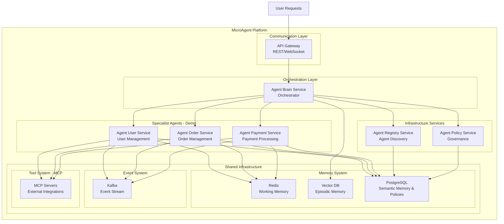
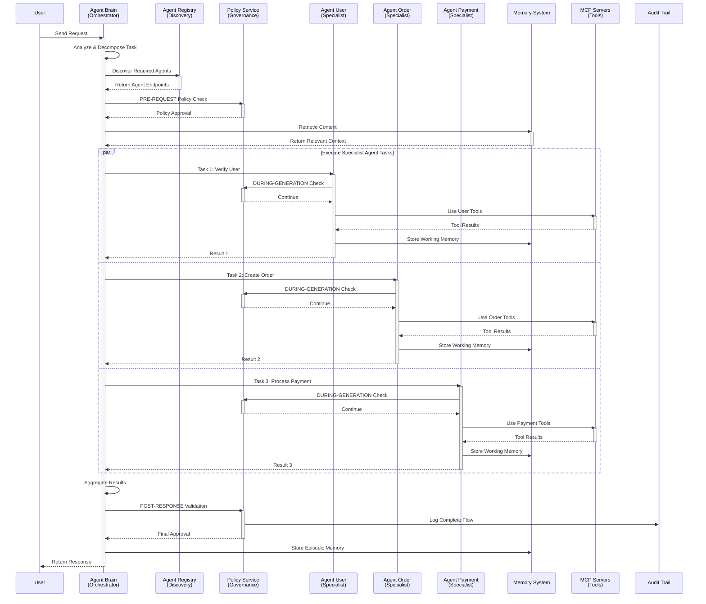

# MicroAgent Platform

**The Enterprise AI Agent Framework that Scales Like Microservices**

MicroAgent bridges the gap between traditional microservices architecture and AI agent systems, delivering a production-ready platform for building scalable, governed, and trustworthy AI-powered applications.

## Why MicroAgent?

### The Challenge
Organizations need AI agents that can:
- Scale independently based on demand
- Enforce governance and compliance policies
- Discover and coordinate with other agents dynamically
- Execute complex multi-step tasks reliably
- Maintain security and auditability at enterprise scale

### The Solution
MicroAgent combines the **independence and scalability of microservices** with the **intelligence and autonomy of AI agents**, creating a platform where each agent operates as an independent service with built-in orchestration, governance, and discovery.

## Core Architecture: Four Pillars of Trust

### 1. Agent Brain - The Orchestrator
The central intelligence that coordinates complex, multi-agent workflows:
- **Task Decomposition**: Breaks down complex requests into manageable sub-tasks
- **Agent Discovery**: Dynamically finds and routes to specialist agents via registry
- **Parallel Execution**: Coordinates multiple agents working simultaneously
- **Result Aggregation**: Combines outputs into coherent responses
- **Adaptive Planning**: Uses reasoning engine to optimize execution strategies

### 2. Agent Registry - The Directory
Centralized service discovery and routing for dynamic agent ecosystems:
- **Dynamic Registration**: Agents self-register with capabilities and metadata
- **Capability Matching**: Intelligent routing based on agent capabilities
- **Health Monitoring**: Tracks agent availability and performance
- **Version Management**: Supports multiple agent versions concurrently
- **Load Balancing**: Distributes requests across agent instances

### 3. Policy Service - The Guardian
Three-phase governance framework ensuring compliance and security:
- **PRE-REQUEST Phase**: Validates requests before execution (input sanitization, auth checks)
- **DURING-GENERATION Phase**: Monitors and controls agent behavior in real-time
- **POST-RESPONSE Phase**: Validates outputs, applies transformations, maintains audit trails
- **Dynamic Policy Updates**: Modify governance rules without redeploying agents
- **Compliance Reporting**: Full audit trails for regulatory requirements

### 4. Specialist Agents - The Experts
Domain-focused microservices with AI capabilities:
- **Independent Scaling**: Each agent scales based on its own load patterns
- **Domain Expertise**: Focused on specific business capabilities (User, Order, Payment)
- **Tool Integration**: Access to domain-specific tools via MCP protocol
- **Memory Systems**: Semantic, episodic, and working memory per agent
- **Fault Isolation**: Issues in one agent don't cascade to others

## Architecture Diagram



## How It Works

Here's a complete flow showing all components working together:



## Key Features

### Enterprise Scalability
- **Microservices-Based**: Each agent is an independent Spring Boot service
- **Horizontal Scaling**: Scale individual agents based on specific demands
- **Cloud-Native**: Deploy on Kubernetes, Docker Swarm, or any container orchestration platform
- **Database per Service**: PostgreSQL for policies/memory, Redis for caching, Vector DB for episodic memory
- **Event-Driven**: Kafka-based event streaming for async communication

### Governance & Compliance
- **Three-Phase Policy Enforcement**: Pre-request, during-generation, post-response validation
- **Audit Trails**: Complete logging of all agent interactions for compliance
- **Dynamic Policy Updates**: Modify governance rules without service interruption
- **OWASP Security**: Built-in HTML sanitization and security best practices
- **Role-Based Access**: Fine-grained authorization for agent capabilities

### Intelligent Orchestration
- **Task Decomposition**: Automatically breaks complex requests into sub-tasks
- **Parallel Execution**: Runs independent tasks simultaneously for speed
- **Adaptive Reasoning**: LLM-powered planning and decision-making
- **Error Recovery**: Handles failures gracefully with retry and fallback strategies
- **Memory Integration**: Context-aware execution using multi-tier memory system

### Developer Experience
- **Clean Architecture**: Hexagonal architecture with clear separation of concerns
- **Package-by-Feature**: Intuitive code organization by business capability
- **CQRS Pattern**: Command-query separation for optimal read/write patterns
- **Type Safety**: MapStruct for compile-time DTO/Entity mapping
- **Testability**: TestContainers for integration testing, isolated unit tests

### Tool Integration
- **MCP Protocol**: Model Context Protocol for standardized tool integration
- **Dynamic Discovery**: Tools registered and discovered at runtime
- **Security**: Sandboxed tool execution with policy enforcement
- **Custom Tools**: Easy framework for adding domain-specific tools
- **Multi-Agent Tools**: Shared and agent-specific tool registries

## Use Cases

### E-Commerce Platform
Deploy User, Order, and Payment specialist agents that work together:
- User agent handles authentication, profile management, preferences
- Order agent manages cart, inventory, order lifecycle
- Payment agent processes transactions, refunds, billing
- Agent Brain orchestrates multi-step checkout flows

### Customer Support System
Combine specialist agents for comprehensive support:
- FAQ agent for common questions
- Technical Support agent for troubleshooting
- Escalation agent for complex issues
- Agent Brain routes based on query complexity and expertise needed

### Financial Services
Build compliant, auditable AI systems:
- Fraud Detection agent monitors transactions
- Risk Assessment agent evaluates portfolios
- Compliance agent ensures regulatory adherence
- Policy Service enforces financial regulations and audit trails

## Technology Stack

| Component | Technology | Purpose |
|-----------|-----------|---------|
| **Core Framework** | Spring Boot 3.5.9 | Microservices foundation |
| **AI Integration** | Spring AI 1.1.2 | LLM connectivity (Anthropic Claude) |
| **Runtime** | Java 21 | Modern JVM features |
| **Data Store** | PostgreSQL 16.4 | Relational data, policies, semantic memory |
| **Caching** | Redis 7.2 | Working memory, session data |
| **Vector DB** | Qdrant/Pinecone | Episodic memory, embeddings |
| **Messaging** | Apache Kafka | Event streaming, async communication |
| **Mapping** | MapStruct 1.5.5 | Type-safe DTO/Entity conversion |
| **Development** | Lombok 1.18.30 | Boilerplate reduction |
| **Testing** | TestContainers | Integration testing |
| **Orchestration** | Kubernetes/Docker | Container deployment |
| **Monitoring** | Prometheus/Grafana | Metrics and observability |

## Project Structure

```
microagent/
├── agentic-framework/              # Shared AI Agent Framework
│   ├── agent-shared/               # Common utilities
│   ├── agent-core/                 # Core orchestration
│   ├── agent-brain/                # Brain/reasoning engine
│   ├── agent-context/              # Context management
│   ├── agent-memory/               # Multi-tier memory
│   ├── agent-planning/             # Task planning
│   ├── agent-reasoning/            # Decision-making
│   ├── agent-task/                 # Task execution
│   ├── agent-tools/                # MCP tool integration
│   └── agent-engage/               # Communication layer
│
├── agent-brain/                    # Agent Brain Orchestrator Service
│   ├── brain-api/                  # REST/WebSocket APIs
│   ├── brain-app/                  # Spring Boot application
│   ├── brain-core/                 # Orchestration logic (CQRS)
│   ├── brain-data-access/          # Repository implementations
│   ├── brain-shared/               # Constants, DTOs, exceptions
│   └── brain-test/                 # Integration tests
│
├── agent-registry-service/         # Agent Registry Service
│   ├── registry-api/               # REST APIs
│   ├── registry-app/               # Spring Boot application
│   ├── registry-core/              # Registration logic
│   ├── registry-data-access/       # Repository implementations
│   ├── registry-shared/            # Constants, DTOs, exceptions
│   └── registry-test/              # Integration tests
│
├── agent-policy-service/           # Policy & Governance Service
│   ├── policy-api/                 # REST APIs
│   ├── policy-app/                 # Spring Boot application
│   ├── policy-core/                # Policy enforcement logic
│   ├── policy-data-access/         # Repository implementations
│   ├── policy-shared/              # Constants, DTOs, exceptions
│   └── policy-test/                # Integration tests
│
└── agent-demo/                     # Demo Specialist Agents
    ├── agent-user-service/         # User Management Agent
    │   ├── user-api/
    │   ├── user-app/
    │   ├── user-core/
    │   ├── user-data-access/
    │   ├── user-shared/
    │   └── user-test/
    ├── agent-order-service/        # Order Management Agent
    │   ├── order-api/
    │   ├── order-app/
    │   ├── order-core/
    │   ├── order-data-access/
    │   ├── order-shared/
    │   └── order-test/
    └── agent-payment-service/      # Payment Processing Agent
        ├── payment-api/
        ├── payment-app/
        ├── payment-core/
        ├── payment-data-access/
        ├── payment-shared/
        └── payment-test/
```

Each service follows the **6-Module BASE MICROSERVICE STRUCTURE**:
- **api**: REST/WebSocket controllers
- **app**: Spring Boot main application
- **core**: Business logic (CQRS pattern, package-by-feature)
- **data-access**: JPA repositories, database configuration
- **shared**: Constants, enums, exceptions, DTOs, HTTP APIs
- **test**: Integration tests with TestContainers

## Getting Started

### Prerequisites
- Java 21 or higher
- Maven 3.8+
- Docker & Docker Compose
- PostgreSQL 16.4
- Redis 7.2
- Anthropic API key (for Claude integration)

### Quick Start

1. **Clone the repository:**
   ```bash
   git clone https://github.com/yourorg/microagent.git
   cd microagent
   ```

2. **Start infrastructure services:**
   ```bash
   cd docker-compose
   docker-compose up -d
   ```
   This starts PostgreSQL, Redis, Kafka, and monitoring tools.

3. **Configure API keys:**
   Edit configuration files for each service:
   ```bash
   # Agent Brain
   vi agent-brain/brain-app/src/main/resources/application.yml
   # Add: spring.ai.anthropic.api-key=<your-key>
   ```

4. **Build the project:**
   ```bash
   mvn clean install
   ```

5. **Start services:**
   ```bash
   # Terminal 1: Agent Registry
   cd agent-registry-service/registry-app
   mvn spring-boot:run

   # Terminal 2: Policy Service
   cd agent-policy-service/policy-app
   mvn spring-boot:run

   # Terminal 3: Agent Brain
   cd agent-brain/brain-app
   mvn spring-boot:run

   # Terminal 4-6: Specialist Agents
   cd agent-demo/agent-user-service/user-app
   mvn spring-boot:run
   # ... repeat for order and payment services
   ```


### Development

**Code formatting:**
```bash
mvn spotless:apply
```

**Run tests:**
```bash
mvn test
```

**Integration tests:**
```bash
cd agent-brain/brain-test
mvn verify
```

**View architecture:**
See comprehensive architecture documentation in `/docs/architecture/`:
- `architecture_visual_mermaid.md` - Visual diagrams
- `agent_architecture_diagram.md` - Detailed component architecture
- `high_level_java_design.md` - Layer-by-layer design
- `agent_registry_architecture.md` - Registry service deep dive
- `agent_policy_governance.md` - Policy enforcement details

## Performance & Scale

MicroAgent is designed for enterprise workloads:

- **Throughput**: 10,000+ requests/second (distributed across specialist agents)
- **Latency**: Sub-second orchestration overhead
- **Scalability**: Linearly scales with agent instances
- **Availability**: 99.9% uptime with proper infrastructure
- **Memory**: Efficient multi-tier memory system (Redis + Vector DB)

## Contributing

We welcome contributions! Please see `CONTRIBUTING.md` for guidelines.

### Development Workflow
1. Fork the repository
2. Create a feature branch
3. Follow the architecture patterns in `/docs/architecture/`
4. Add tests for new functionality
5. Run `mvn spotless:apply` before committing
6. Submit a pull request

## License

Copyright (c) 2025. All rights reserved.

## Resources

- **Documentation**: `/docs/architecture/` directory
- **API Docs**: OpenAPI specs in each service's `api` module
- **Examples**: Sample requests in `/docs/examples/`
- **Architecture Decisions**: ADRs in `/docs/adr/`

## Roadmap

- [ ] Advanced caching strategies
- [ ] Multi-cloud deployment templates
- [ ] Enhanced observability dashboards
- [ ] Agent marketplace for third-party agents
- [ ] Advanced reasoning strategies (ReAct, Chain-of-Thought)
- [ ] Support for additional LLM providers


---

**Built with trust, governance, and scale in mind.**
