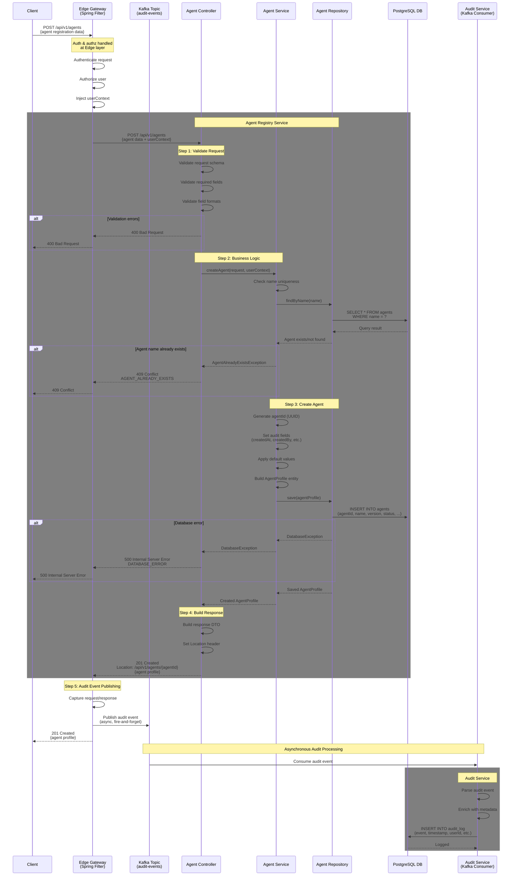

# [V1] Create Agent Profile API

## Overview

**Endpoint**: `POST /api/v1/agents`
**Purpose**: Register a new agent profile in the Agent Registry system
**Version**: 1.0.0
**Last Updated**: 2026-01-10

This API creates a basic agent profile with core metadata including name, version, domain, type, status, and ownership information.

---

## Processing Rule - Sequence Diagram

### Full Request Flow

This diagram illustrates the complete processing flow for agent registration, including all validation steps, business logic, and data persistence operations.



---

## Processing Steps Summary (Pseudocode)

### Edge Layer - Spring Filter (Audit Event Publishing)

```pseudocode
CLASS AuditFilter EXTENDS OncePerRequestFilter:

    FUNCTION doFilterInternal(request, response, filterChain):
        // Wrap request and response to capture data
        wrappedRequest = new ContentCachingRequestWrapper(request)
        wrappedResponse = new ContentCachingResponseWrapper(response)

        startTime = getCurrentTimestamp()

        TRY:
            // Continue with the filter chain
            filterChain.doFilter(wrappedRequest, wrappedResponse)
        FINALLY:
            // After request is processed, publish audit event
            endTime = getCurrentTimestamp()

            auditEvent = {
                eventId: generateUUID(),
                eventType: "API_REQUEST",
                timestamp: startTime,
                duration: endTime - startTime,
                method: request.getMethod(),
                endpoint: request.getRequestURI(),
                statusCode: response.getStatus(),
                userId: extractUserIdFromContext(),
                tenantId: extractTenantIdFromContext(),
                requestBody: wrappedRequest.getContentAsString(),
                responseBody: wrappedResponse.getContentAsString(),
                ipAddress: request.getRemoteAddr(),
                userAgent: request.getHeader("User-Agent")
            }

            // Publish to Kafka asynchronously (fire-and-forget)
            kafkaTemplate.send("audit-events", auditEvent)

            // Copy response back to original response
            wrappedResponse.copyBodyToResponse()
        END TRY
    END FUNCTION

END CLASS
```

### Agent Registry Service - Main Processing Logic

```pseudocode
FUNCTION createAgentProfile(request, userContext):
    // Note: Authentication & Authorization handled at Edge layer
    // userContext is pre-validated and injected by Edge Gateway
    // Audit logging handled asynchronously by Edge Filter -> Kafka -> Audit Consumer

    // ==========================================
    // Step 1: Validate Request (Agent Controller)
    // ==========================================
    TRY:
        validateRequestSchema(request)
        validateRequiredFields(request, ["name", "version", "domain", "type"])
        validateFieldFormats(request)
        validateFieldConstraints(request)
    CATCH ValidationError:
        RETURN 400 Bad Request

    // ==========================================
    // Step 2: Business Logic (Agent Service)
    // ==========================================
    TRY:
        // Check name uniqueness (case-insensitive)
        existingAgent = agentRepository.findByName(request.name)
        IF existingAgent EXISTS:
            RETURN 409 Conflict "AGENT_ALREADY_EXISTS"

    CATCH BusinessValidationError:
        RETURN appropriate error code (409)

    // ==========================================
    // Step 3: Create Agent (Agent Repository)
    // ==========================================
    TRY:
        // Prepare agent entity
        agentId = generateUUID()
        currentTimestamp = getCurrentTimestamp()

        agentProfile = {
            agentId: agentId,
            name: request.name,
            description: request.description,
            version: request.version,
            status: request.status || "DRAFT",
            domain: request.domain,
            type: request.type,
            ownerId: userContext.userId,
            ownerType: "USER",
            createdAt: currentTimestamp,
            updatedAt: currentTimestamp,
            createdBy: userContext.userId,
            updatedBy: userContext.userId
        }

        // Single insert operation
        database.insert("agents", agentProfile)

    CATCH DatabaseError:
        RETURN 500 Internal Server Error "DATABASE_ERROR"

    // ==========================================
    // Step 4: Build Response (Agent Controller)
    // ==========================================
    responseDTO = buildResponseDTO(agentProfile)
    locationHeader = "/api/v1/agents/" + agentId

    RETURN {
        status: 201 Created,
        headers: {
            "Location": locationHeader,
            "Content-Type": "application/json"
        },
        body: responseDTO
    }

END FUNCTION
```

### Audit Service - Kafka Consumer

```pseudocode
CLASS AuditEventConsumer:

    @KafkaListener(topics = "audit-events", groupId = "audit-service-group")
    FUNCTION consumeAuditEvent(auditEvent):
        // Step 5: Asynchronous Audit Processing

        TRY:
            // Parse and enrich audit event
            enrichedEvent = {
                ...auditEvent,
                processedAt: getCurrentTimestamp(),
                environment: getEnvironment(),
                region: getRegion()
            }

            // Extract business event details if applicable
            IF enrichedEvent.endpoint MATCHES "/api/v1/agents" AND enrichedEvent.method == "POST":
                enrichedEvent.businessEventType = "AGENT_CREATED"
                enrichedEvent.agentId = extractAgentIdFromResponse(enrichedEvent.responseBody)
                enrichedEvent.agentName = extractAgentNameFromRequest(enrichedEvent.requestBody)

            // Persist to audit log database
            database.insert("audit_log", enrichedEvent)

            LOG("Audit event processed successfully: " + enrichedEvent.eventId)

        CATCH Exception as error:
            // Log error and send to dead letter queue for retry
            LOG_ERROR("Failed to process audit event: " + error)
            kafkaTemplate.send("audit-events-dlq", auditEvent)
        END TRY

    END FUNCTION

END CLASS
```

---

## Key Validation Rules

| Rule | Description | Error Code |
|------|-------------|------------|
| **Unique Name** | Agent name must be unique (case-insensitive) | `AGENT_ALREADY_EXISTS` (409) |
| **Semantic Version** | Version must follow `MAJOR.MINOR.PATCH` format | `INVALID_VERSION_FORMAT` (400) |
| **Required Fields** | Name, version, domain, and type are required | `MISSING_REQUIRED_FIELDS` (400) |
| **Valid Status** | Status must be one of: DRAFT, ACTIVE, INACTIVE, ARCHIVED | `INVALID_STATUS` (400) |

---

## Database Transactions

Agent creation uses a single insert operation:

```sql
-- Insert agent profile
INSERT INTO agents (
  agent_id,
  name,
  description,
  version,
  status,
  domain,
  type,
  owner_id,
  owner_type,
  created_at,
  updated_at,
  created_by,
  updated_by
) VALUES (
  ?,  -- agent_id (UUID)
  ?,  -- name
  ?,  -- description
  ?,  -- version (e.g., '1.0.0')
  ?,  -- status (default: 'DRAFT')
  ?,  -- domain (e.g., 'CUSTOMER_SERVICE')
  ?,  -- type (e.g., 'CONVERSATIONAL')
  ?,  -- owner_id (from userContext.userId)
  ?,  -- owner_type (default: 'USER')
  NOW(),  -- created_at
  NOW(),  -- updated_at
  ?,  -- created_by (from userContext.userId)
  ?   -- updated_by (from userContext.userId)
);
```

**Failure Handling**: If the insert fails (e.g., due to constraint violations or database errors), a 500 Internal Server Error is returned.

---

## Timing Expectations

### Synchronous Request Flow

| Step | Typical Duration | Timeout |
|------|------------------|---------|
| Edge Layer Processing (Auth/Authz) | 20-50ms | 5s |
| Request Validation (Step 1) | 50-100ms | 5s |
| Business Validation (Step 2) | 30-60ms | 5s |
| Database Insertion (Step 3) | 50-100ms | 10s |
| Response Building (Step 4) | 10-20ms | 1s |
| Edge Filter - Kafka Publish | 5-10ms | 1s |
| **Total Request** | **165-340ms** | **30s** |

### Asynchronous Audit Processing

| Step | Typical Duration | Notes |
|------|------------------|-------|
| Kafka Event Delivery | 10-50ms | Async, does not block request |
| Audit Consumer Processing (Step 5) | 50-100ms | Independent from request flow |
| Database Audit Log Insert | 20-50ms | Separate transaction |
| **Total Audit Processing** | **80-200ms** | Fire-and-forget from client perspective |

---

## Audit Architecture Pattern

### Event-Driven Audit Logging

This API implements an event-driven audit pattern using Kafka for asynchronous, non-blocking audit logging:

**Benefits:**
- **Decoupled**: Audit logging is completely decoupled from business logic
- **Non-blocking**: Audit failures don't impact API response times or availability
- **Centralized**: All API requests are audited consistently at the Edge layer
- **Scalable**: Kafka provides horizontal scalability for high-volume audit events
- **Resilient**: Dead letter queue (DLQ) handles failed audit events for retry

**Architecture Components:**

1. **Edge Gateway - Spring Filter** (`AuditFilter`)
   - Extends `OncePerRequestFilter` in Spring Boot
   - Wraps request/response using `ContentCachingRequestWrapper` and `ContentCachingResponseWrapper`
   - Captures full request/response payload, headers, and metadata
   - Publishes audit events to Kafka topic `audit-events` asynchronously
   - Fire-and-forget pattern - doesn't wait for Kafka confirmation

2. **Kafka Topic** (`audit-events`)
   - Message broker for audit events
   - Provides durability, ordering, and replay capabilities
   - Supports multiple consumers for different audit use cases
   - Configured with appropriate retention policy

3. **Audit Service - Kafka Consumer** (`AuditEventConsumer`)
   - Consumes events from `audit-events` topic
   - Enriches events with additional metadata (environment, region, etc.)
   - Extracts business event details from request/response payloads
   - Persists to `audit_log` database table
   - Sends failed events to `audit-events-dlq` for retry

**Event Schema:**

```json
{
  "eventId": "uuid",
  "eventType": "API_REQUEST",
  "timestamp": "2026-01-10T12:00:00Z",
  "duration": 165,
  "method": "POST",
  "endpoint": "/api/v1/agents",
  "statusCode": 201,
  "userId": "user-123",
  "tenantId": "tenant-456",
  "requestBody": "{...}",
  "responseBody": "{...}",
  "ipAddress": "192.168.1.1",
  "userAgent": "Mozilla/5.0...",
  "businessEventType": "AGENT_CREATED",
  "agentId": "550e8400-e29b-41d4-a716-446655440000",
  "agentName": "customer-support-agent"
}
```

---

## Request/Response Schema

### Request Body

```json
{
  "name": "customer-support-agent",
  "description": "AI agent for handling customer support inquiries",
  "version": "1.0.0",
  "status": "DRAFT",
  "domain": "CUSTOMER_SERVICE",
  "type": "CONVERSATIONAL"
}
```

**Field Descriptions:**
- `name` (string, required): Unique agent name (case-insensitive)
- `description` (string, optional): Human-readable description of the agent
- `version` (string, required): Semantic version in MAJOR.MINOR.PATCH format
- `status` (string, optional): Agent status - DRAFT, ACTIVE, INACTIVE, ARCHIVED (default: DRAFT)
- `domain` (string, required): Business domain (e.g., CUSTOMER_SERVICE, SALES, SUPPORT)
- `type` (string, required): Agent type (e.g., CONVERSATIONAL, TASK_ORIENTED, ANALYTICAL)

### Success Response (201 Created)

```json
{
  "agentId": "550e8400-e29b-41d4-a716-446655440000",
  "name": "customer-support-agent",
  "description": "AI agent for handling customer support inquiries",
  "version": "1.0.0",
  "status": "DRAFT",
  "domain": "CUSTOMER_SERVICE",
  "type": "CONVERSATIONAL",
  "ownerId": "user-123",
  "ownerType": "USER",
  "createdAt": "2026-01-10T12:00:00Z",
  "updatedAt": "2026-01-10T12:00:00Z",
  "createdBy": "user-123",
  "updatedBy": "user-123"
}
```

**Response Headers:**
```
Location: /api/v1/agents/550e8400-e29b-41d4-a716-446655440000
Content-Type: application/json
```

### Error Responses

#### 400 Bad Request - Invalid Request
```json
{
  "error": "INVALID_VERSION_FORMAT",
  "message": "Version must follow MAJOR.MINOR.PATCH format",
  "timestamp": "2026-01-10T12:00:00Z"
}
```

#### 409 Conflict - Agent Already Exists
```json
{
  "error": "AGENT_ALREADY_EXISTS",
  "message": "An agent with name 'customer-support-agent' already exists",
  "timestamp": "2026-01-10T12:00:00Z"
}
```

#### 500 Internal Server Error - Database Error
```json
{
  "error": "DATABASE_ERROR",
  "message": "An error occurred while creating the agent profile",
  "timestamp": "2026-01-10T12:00:00Z"
}
```

---

## Usage Examples

### cURL Example

```bash
curl -X POST "https://api.example.com/api/v1/agents" \
  -H "Authorization: Bearer YOUR_ACCESS_TOKEN" \
  -H "Content-Type: application/json" \
  -d '{
    "name": "customer-support-agent",
    "description": "AI agent for handling customer support inquiries",
    "version": "1.0.0",
    "status": "DRAFT",
    "domain": "CUSTOMER_SERVICE",
    "type": "CONVERSATIONAL"
  }'
```

### JavaScript Example

```javascript
const response = await fetch('https://api.example.com/api/v1/agents', {
  method: 'POST',
  headers: {
    'Authorization': 'Bearer YOUR_ACCESS_TOKEN',
    'Content-Type': 'application/json'
  },
  body: JSON.stringify({
    name: 'customer-support-agent',
    description: 'AI agent for handling customer support inquiries',
    version: '1.0.0',
    status: 'DRAFT',
    domain: 'CUSTOMER_SERVICE',
    type: 'CONVERSATIONAL'
  })
});

const agentProfile = await response.json();
console.log('Created agent:', agentProfile);
console.log('Agent ID:', agentProfile.agentId);
```

### Python Example

```python
import requests

response = requests.post(
    'https://api.example.com/api/v1/agents',
    headers={
        'Authorization': 'Bearer YOUR_ACCESS_TOKEN',
        'Content-Type': 'application/json'
    },
    json={
        'name': 'customer-support-agent',
        'description': 'AI agent for handling customer support inquiries',
        'version': '1.0.0',
        'status': 'DRAFT',
        'domain': 'CUSTOMER_SERVICE',
        'type': 'CONVERSATIONAL'
    }
)

agent_profile = response.json()
print(f"Created agent: {agent_profile['agentId']}")
```

---

**Last Updated**: 2026-01-10
**Version**: 1.0.0
