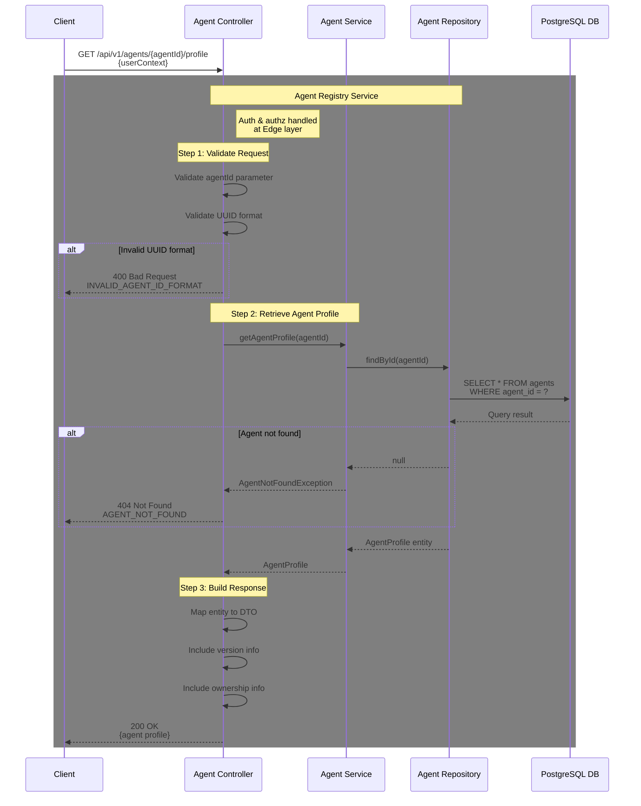

# [V1] Get Agent Profile API

## Overview

**Endpoint**: `GET /api/v1/agents/{agentId}/profile`
**Purpose**: Retrieve a single agent profile by agent ID
**Version**: 1.0.0
**Last Updated**: 2026-01-10

This API retrieves a basic agent profile by its unique identifier, including core metadata such as version, ownership information, and status.

---

## Processing Rule - Sequence Diagram

### Full Request Flow

This diagram illustrates the complete processing flow for retrieving an agent profile, including validation steps and data retrieval operations.



---

## Processing Steps Summary (Pseudocode)

```pseudocode
FUNCTION getAgentProfile(agentId, userContext):
    // Note: Authentication & Authorization handled at Edge layer
    // userContext is pre-validated and injected by Edge Gateway

    // ==========================================
    // Step 1: Validate Request (Agent Controller)
    // ==========================================
    TRY:
        validateAgentIdFormat(agentId)

        IF NOT isValidUUID(agentId):
            RETURN 400 Bad Request "INVALID_AGENT_ID_FORMAT"

    CATCH ValidationError:
        RETURN 400 Bad Request

    // ==========================================
    // Step 2: Retrieve Agent Profile (Agent Service)
    // ==========================================
    TRY:
        // Query agent from database
        agentProfile = agentRepository.findById(agentId)

        // Check if agent exists
        IF agentProfile IS NULL:
            RETURN 404 Not Found "AGENT_NOT_FOUND"

        // Agent found, proceed to response building

    CATCH DatabaseError:
        RETURN 500 Internal Server Error "DATABASE_ERROR"

    // ==========================================
    // Step 3: Build Response (Agent Controller)
    // ==========================================
    TRY:
        // Map entity to response DTO
        responseDTO = {
            agentId: agentProfile.agentId,
            name: agentProfile.name,
            description: agentProfile.description,
            version: agentProfile.version,
            status: agentProfile.status,
            domain: agentProfile.domain,
            type: agentProfile.type,
            ownerId: agentProfile.ownerId,
            ownerType: agentProfile.ownerType,
            createdAt: agentProfile.createdAt,
            updatedAt: agentProfile.updatedAt
        }

    CATCH Exception:
        RETURN 500 Internal Server Error

    RETURN {
        status: 200 OK,
        headers: {
            "Content-Type": "application/json"
        },
        body: responseDTO
    }

END FUNCTION
```

---

## Key Validation Rules

| Rule | Description | Error Code |
|------|-------------|------------|
| **Valid UUID Format** | agentId must be a valid UUID format | `INVALID_AGENT_ID_FORMAT` (400) |
| **Agent Exists** | Agent must exist in the database | `AGENT_NOT_FOUND` (404) |

---

## Database Transactions

This is a read-only operation with no transaction required.

```sql
-- Single SELECT query with indexed lookup
SELECT
    agent_id,
    name,
    description,
    version,
    status,
    domain,
    type,
    owner_id,
    owner_type,
    created_at,
    updated_at,
    created_by,
    updated_by
FROM agents
WHERE agent_id = ?;
```

**Performance Notes**:
- Query uses primary key index on `agent_id` for fast lookup
- No joins required for basic profile retrieval
- Read operation does not require locking

---

## Timing Expectations

| Step | Typical Duration | Timeout |
|------|------------------|---------|
| Request Validation (Step 1) | 10-20ms | 2s |
| Database Query (Step 2) | 30-80ms | 5s |
| Response Building (Step 3) | 10-20ms | 1s |
| **Total Request** | **50-120ms** | **10s** |

---

## Response Schema

### Success Response (200 OK)

```json
{
  "agentId": "550e8400-e29b-41d4-a716-446655440000",
  "name": "customer-support-agent",
  "description": "AI agent for handling customer support inquiries",
  "version": "1.2.0",
  "status": "ACTIVE",
  "domain": "CUSTOMER_SERVICE",
  "type": "CONVERSATIONAL",
  "ownerId": "user-123",
  "ownerType": "USER",
  "createdAt": "2026-01-05T10:30:00Z",
  "updatedAt": "2026-01-08T14:22:00Z"
}
```

### Error Responses

#### 400 Bad Request - Invalid UUID Format
```json
{
  "error": "INVALID_AGENT_ID_FORMAT",
  "message": "The provided agentId is not a valid UUID format",
  "timestamp": "2026-01-10T12:00:00Z"
}
```

#### 404 Not Found - Agent Not Found
```json
{
  "error": "AGENT_NOT_FOUND",
  "message": "Agent with ID '550e8400-e29b-41d4-a716-446655440000' does not exist",
  "timestamp": "2026-01-10T12:00:00Z"
}
```

#### 500 Internal Server Error - Database Error
```json
{
  "error": "DATABASE_ERROR",
  "message": "An error occurred while retrieving the agent profile",
  "timestamp": "2026-01-10T12:00:00Z"
}
```

---

## Usage Examples

### cURL Example

```bash
curl -X GET "https://api.example.com/api/v1/agents/550e8400-e29b-41d4-a716-446655440000/profile" \
  -H "Authorization: Bearer YOUR_ACCESS_TOKEN" \
  -H "Content-Type: application/json"
```

### JavaScript Example

```javascript
const agentId = '550e8400-e29b-41d4-a716-446655440000';

const response = await fetch(`https://api.example.com/api/v1/agents/${agentId}/profile`, {
  method: 'GET',
  headers: {
    'Authorization': 'Bearer YOUR_ACCESS_TOKEN',
    'Content-Type': 'application/json'
  }
});

const agentProfile = await response.json();
console.log(agentProfile);
```

### Python Example

```python
import requests

agent_id = '550e8400-e29b-41d4-a716-446655440000'

response = requests.get(
    f'https://api.example.com/api/v1/agents/{agent_id}/profile',
    headers={
        'Authorization': 'Bearer YOUR_ACCESS_TOKEN',
        'Content-Type': 'application/json'
    }
)

agent_profile = response.json()
print(agent_profile)
```

---

**Last Updated**: 2026-01-10
**Version**: 1.0.0