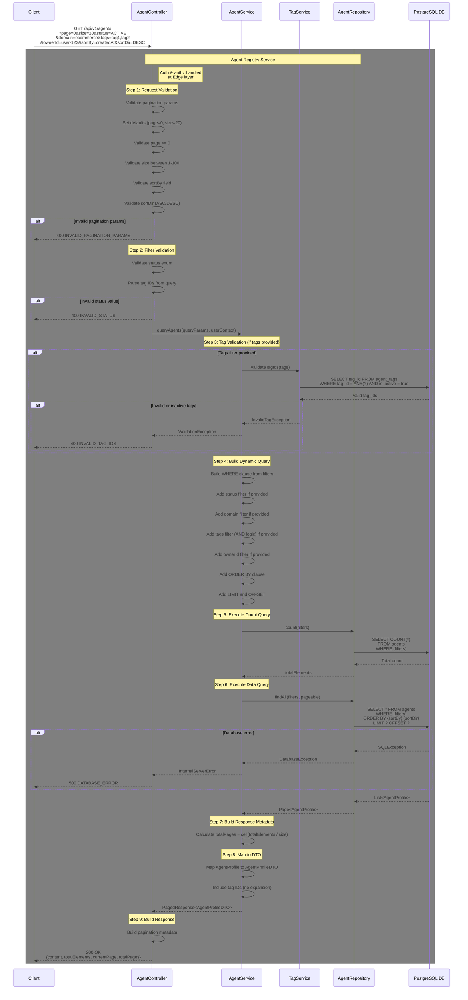

# [V1] Query Agents with Pagination API

## Overview

**Endpoint**: `GET /api/v1/agents`
**Purpose**: Query agent profiles with pagination, filtering, and sorting
**Version**: 1.0.0
**Last Updated**: 2026-01-11

This API retrieves a paginated list of agent profiles with comprehensive filtering capabilities. It supports filtering by status, domain, tags (AND logic), and owner, along with sorting by creation date. The API uses offset-based pagination (page & size) for predictable navigation and supports jumping to specific pages. Results include full agent profile details with tag IDs for efficient querying.

---

## Processing Rule - Sequence Diagram

### Full Request Flow

This diagram illustrates the complete processing flow for querying agents with pagination, including validation steps and data operations.



---

## Processing Steps Summary (Pseudocode)

```pseudocode
FUNCTION queryAgents(queryParams, userContext):
    // Note: Authentication & Authorization handled at Edge layer
    // userContext is pre-validated and injected by Edge Gateway

    // Step 1: Request Validation
    page = queryParams.page ?? 0
    size = queryParams.size ?? 20
    sortBy = queryParams.sortBy ?? "createdAt"
    sortDir = queryParams.sortDir ?? "DESC"

    IF page < 0:
        THROW ValidationException("INVALID_PAGINATION_PARAMS: page must be >= 0", 400)

    IF size < 1 OR size > 100:
        THROW ValidationException("INVALID_PAGINATION_PARAMS: size must be between 1 and 100", 400)

    validSortFields = ["createdAt", "updatedAt", "name", "version"]
    IF sortBy NOT IN validSortFields:
        THROW ValidationException("INVALID_SORT_FIELD: must be one of " + validSortFields, 400)

    IF sortDir NOT IN ["ASC", "DESC"]:
        THROW ValidationException("INVALID_SORT_DIRECTION: must be ASC or DESC", 400)

    // Step 2: Filter Validation
    status = queryParams.status
    IF status IS NOT NULL:
        validStatuses = ["DRAFT", "ACTIVE", "INACTIVE", "ARCHIVED"]
        IF status NOT IN validStatuses:
            THROW ValidationException("INVALID_STATUS: must be one of " + validStatuses, 400)

    domain = queryParams.domain
    tags = queryParams.tags  // Comma-separated tag IDs
    ownerId = queryParams.ownerId

    // Step 3: Tag Validation (if tags provided)
    tagIds = []
    IF tags IS NOT NULL AND tags IS NOT EMPTY:
        tagIds = split(tags, ",")
        validTagIds = tagService.validateTagIds(tagIds)
        IF validTagIds.size() != tagIds.size():
            invalidTags = tagIds - validTagIds
            THROW InvalidTagException("INVALID_TAG_IDS: " + invalidTags, 400)

    // Step 4: Build Dynamic Query
    filters = []

    IF status IS NOT NULL:
        filters.add("status = ?", status)

    IF domain IS NOT NULL:
        filters.add("domain = ?", domain)

    IF tagIds IS NOT EMPTY:
        // AND logic: agent must have ALL specified tags
        FOR EACH tagId IN tagIds:
            filters.add("tags @> ?::jsonb", jsonb_build_array(tagId))

    IF ownerId IS NOT NULL:
        filters.add("owner_id = ?", ownerId)

    whereClause = JOIN(filters, " AND ")

    // Step 5: Execute Count Query
    countQuery = "SELECT COUNT(*) FROM agents WHERE " + whereClause
    totalElements = database.executeQuery(countQuery, filterParams)

    // Step 6: Execute Data Query
    offset = page * size

    dataQuery = "SELECT * FROM agents" +
                " WHERE " + whereClause +
                " ORDER BY " + sortBy + " " + sortDir +
                " LIMIT ? OFFSET ?"

    TRY:
        agents = database.executeQuery(dataQuery, filterParams + [size, offset])
    CATCH SQLException as error:
        LOG_ERROR("Database error querying agents: " + error)
        THROW DatabaseException("DATABASE_ERROR", 500)
    END TRY

    // Step 7: Build Response Metadata
    totalPages = CEIL(totalElements / size)

    // Step 8: Map to DTO
    agentDTOs = []
    FOR EACH agent IN agents:
        agentDTO = {
            agentId: agent.agentId,
            name: agent.name,
            description: agent.description,
            version: agent.version,
            status: agent.status,
            domain: agent.domain,
            ownerId: agent.ownerId,
            ownerType: agent.ownerType,
            tags: agent.tags,  // Array of tag IDs (no expansion)
            modelConfig: agent.modelConfig,
            metadata: agent.metadata,
            createdAt: agent.createdAt,
            updatedAt: agent.updatedAt,
            createdBy: agent.createdBy,
            updatedBy: agent.updatedBy
        }
        agentDTOs.add(agentDTO)

    // Step 9: Build Response
    response = {
        content: agentDTOs,
        totalElements: totalElements,
        currentPage: page,
        totalPages: totalPages
    }

    RETURN HTTP 200 OK with response

END FUNCTION
```

---

## Key Validation Rules

| Rule | Description | Error Code |
|------|-------------|------------|
| Valid Page Number | page must be >= 0 | INVALID_PAGINATION_PARAMS (400) |
| Valid Page Size | size must be between 1 and 100 | INVALID_PAGINATION_PARAMS (400) |
| Valid Sort Field | sortBy must be one of: createdAt, updatedAt, name, version | INVALID_SORT_FIELD (400) |
| Valid Sort Direction | sortDir must be ASC or DESC | INVALID_SORT_DIRECTION (400) |
| Valid Status | status must be one of: DRAFT, ACTIVE, INACTIVE, ARCHIVED | INVALID_STATUS (400) |
| Valid Tags | All tag_ids must exist in agent_tags and be active | INVALID_TAG_IDS (400) |
| Default Values | If not provided: page=0, size=20, sortBy=createdAt, sortDir=DESC | N/A |

---

## Database Transactions

### Read-Only Operations

This API performs read-only queries with no transaction management required:

**Count Query:**
```sql
SELECT COUNT(*)
FROM agents
WHERE status = ?
  AND domain = ?
  AND tags @> ?::jsonb
  AND tags @> ?::jsonb
  AND owner_id = ?;
```

**Data Query with Pagination:**
```sql
SELECT
    agent_id,
    name,
    description,
    version,
    status,
    domain,
    owner_id,
    owner_type,
    tags,
    model_config,
    metadata,
    created_at,
    updated_at,
    created_by,
    updated_by
FROM agents
WHERE status = ?
  AND domain = ?
  AND tags @> ?::jsonb  -- First tag (AND logic)
  AND tags @> ?::jsonb  -- Second tag (AND logic)
  AND owner_id = ?
ORDER BY created_at DESC
LIMIT ? OFFSET ?;
```

**Tag Validation Query:**
```sql
SELECT tag_id
FROM agent_tags
WHERE tag_id = ANY(?)
  AND is_active = true;
```

### Transaction Scope

None - All operations are read-only SELECT queries

### Failure Handling

**Database Connection Error:**
- Returns 500 DATABASE_ERROR
- No rollback needed (read-only)
- Client should retry the request

**Query Timeout:**
- Returns 500 DATABASE_TIMEOUT
- Consider adding database query timeout configuration
- Client should retry with smaller page size or simpler filters

---

## Timing Expectations

| Step | Typical Duration | Timeout |
|------|------------------|---------|
| Request Validation | 5-10ms | 2s |
| Filter Validation | 5-10ms | 1s |
| Tag Validation (if tags provided) | 20-50ms | 5s |
| Build Dynamic Query | 5-10ms | 1s |
| Execute Count Query | 30-100ms | 10s |
| Execute Data Query (paginated) | 50-200ms | 15s |
| Build Response Metadata | 5-10ms | 1s |
| Map to DTO | 10-30ms | 2s |
| Build Response | 5-10ms | 1s |
| **Total Request (no tags filter)** | **115-380ms** | **30s** |
| **Total Request (with tags filter)** | **135-430ms** | **30s** |

### Performance Considerations

**Index Usage:**
- Primary key index on `agent_id` (automatic)
- Index on `status` for status filtering
- Index on `domain` for domain filtering
- GIN index on `tags` for tag filtering (JSONB containment queries)
- Index on `owner_id` for ownership filtering
- Index on `created_at` for sorting

**Query Optimization:**
- Count query and data query execute in parallel when possible
- JSONB containment operator `@>` is optimized with GIN index
- LIMIT and OFFSET are efficient for reasonable page numbers
- For deep pagination (page > 100), consider cursor-based pagination

**Recommended Database Indexes:**
```sql
-- Core indexes (from architecture)
CREATE INDEX idx_agents_status ON agents(status);
CREATE INDEX idx_agents_domain ON agents(domain);
CREATE INDEX idx_agents_owner ON agents(owner_id);
CREATE INDEX idx_agents_tags ON agents USING GIN(tags);

-- Additional indexes for sorting
CREATE INDEX idx_agents_created_at ON agents(created_at DESC);
CREATE INDEX idx_agents_updated_at ON agents(updated_at DESC);
CREATE INDEX idx_agents_name ON agents(name);
```

---

## Request & Response Schemas

### Request Schema

**GET /api/v1/agents**

Query Parameters:

| Parameter | Type | Required | Default | Description |
|-----------|------|----------|---------|-------------|
| page | integer | No | 0 | Page number (0-indexed) |
| size | integer | No | 20 | Page size (1-100) |
| sortBy | string | No | createdAt | Sort field: createdAt, updatedAt, name, version |
| sortDir | string | No | DESC | Sort direction: ASC or DESC |
| status | string | No | null | Filter by status: DRAFT, ACTIVE, INACTIVE, ARCHIVED |
| domain | string | No | null | Filter by domain (exact match) |
| tags | string | No | null | Comma-separated tag IDs (AND logic) |
| ownerId | string | No | null | Filter by owner ID |

**Example Request URLs:**

```bash
# Basic pagination (first page, 20 items)
GET /api/v1/agents?page=0&size=20

# Filter by status
GET /api/v1/agents?status=ACTIVE

# Filter by domain and status
GET /api/v1/agents?domain=ecommerce&status=ACTIVE

# Filter by tags (AND logic - agents must have ALL tags)
GET /api/v1/agents?tags=tag-550e8400-e29b-41d4-a716-446655440001,tag-550e8400-e29b-41d4-a716-446655440003

# Filter by owner
GET /api/v1/agents?ownerId=user-123

# Complex query with multiple filters and custom pagination
GET /api/v1/agents?status=ACTIVE&domain=banking&tags=tag-uuid-1,tag-uuid-2&ownerId=user-456&page=1&size=50&sortBy=createdAt&sortDir=ASC

# Sort by name alphabetically
GET /api/v1/agents?sortBy=name&sortDir=ASC

# Get second page of results
GET /api/v1/agents?page=1&size=20
```

### Success Response

**200 OK** - Agents retrieved successfully

```json
{
  "content": [
    {
      "agentId": "550e8400-e29b-41d4-a716-446655440000",
      "name": "ecommerce-support-bot",
      "description": "Handles customer support for e-commerce platform",
      "version": "1.0.0",
      "status": "ACTIVE",
      "domain": "ecommerce",
      "ownerId": "user-123",
      "ownerType": "USER",
      "tags": [
        "tag-550e8400-e29b-41d4-a716-446655440001",
        "tag-550e8400-e29b-41d4-a716-446655440002",
        "tag-550e8400-e29b-41d4-a716-446655440003"
      ],
      "modelConfig": {
        "provider": "anthropic",
        "modelId": "claude-3-opus",
        "temperature": 0.7,
        "maxTokens": 4096,
        "additionalParams": {
          "topP": 0.9,
          "topK": 40
        }
      },
      "metadata": {
        "priority": 10,
        "maxConcurrentRequests": 100,
        "requestTimeout": "PT30S",
        "greetingMessage": "Hello! How can I help you today?",
        "featureFlags": {
          "enableStreaming": true,
          "enableCaching": false
        }
      },
      "createdAt": "2025-12-15T10:30:00Z",
      "updatedAt": "2026-01-10T14:25:30Z",
      "createdBy": "user-123",
      "updatedBy": "user-123"
    },
    {
      "agentId": "660e8400-e29b-41d4-a716-446655440001",
      "name": "banking-assistant",
      "description": "Banking assistant for customer inquiries",
      "version": "2.1.0",
      "status": "ACTIVE",
      "domain": "banking",
      "ownerId": "user-123",
      "ownerType": "USER",
      "tags": [
        "tag-550e8400-e29b-41d4-a716-446655440001",
        "tag-550e8400-e29b-41d4-a716-446655440004"
      ],
      "modelConfig": {
        "provider": "openai",
        "modelId": "gpt-4",
        "temperature": 0.5,
        "maxTokens": 2048
      },
      "metadata": {
        "priority": 20,
        "maxConcurrentRequests": 50
      },
      "createdAt": "2025-11-20T08:15:00Z",
      "updatedAt": "2025-12-28T09:40:00Z",
      "createdBy": "user-456",
      "updatedBy": "user-456"
    }
  ],
  "totalElements": 2,
  "currentPage": 0,
  "totalPages": 1
}
```

**Response Fields:**

| Field | Type | Description |
|-------|------|-------------|
| content | array | Array of agent profile DTOs |
| totalElements | integer | Total number of agents matching filters |
| currentPage | integer | Current page number (0-indexed) |
| totalPages | integer | Total number of pages available |

### Empty Result Response

**200 OK** - No agents found matching criteria

```json
{
  "content": [],
  "totalElements": 0,
  "currentPage": 0,
  "totalPages": 0
}
```

### Error Responses

**400 Bad Request** - Invalid pagination parameters

```json
{
  "error": "INVALID_PAGINATION_PARAMS",
  "message": "Page size must be between 1 and 100",
  "timestamp": "2026-01-11T14:25:30Z",
  "path": "/api/v1/agents?page=0&size=200"
}
```

**400 Bad Request** - Invalid status

```json
{
  "error": "INVALID_STATUS",
  "message": "Status must be one of: DRAFT, ACTIVE, INACTIVE, ARCHIVED",
  "timestamp": "2026-01-11T14:25:30Z",
  "path": "/api/v1/agents?status=INVALID"
}
```

**400 Bad Request** - Invalid sort field

```json
{
  "error": "INVALID_SORT_FIELD",
  "message": "Sort field must be one of: createdAt, updatedAt, name, version",
  "timestamp": "2026-01-11T14:25:30Z",
  "path": "/api/v1/agents?sortBy=invalidField"
}
```

**400 Bad Request** - Invalid tag IDs

```json
{
  "error": "INVALID_TAG_IDS",
  "message": "The following tag IDs are invalid or inactive: [tag-xxx-yyy-zzz]",
  "timestamp": "2026-01-11T14:25:30Z",
  "path": "/api/v1/agents?tags=tag-xxx-yyy-zzz"
}
```

**500 Internal Server Error** - Database error

```json
{
  "error": "DATABASE_ERROR",
  "message": "An error occurred while querying agents",
  "timestamp": "2026-01-11T14:25:30Z",
  "path": "/api/v1/agents"
}
```

---

## Pagination Navigation Examples

### Navigate Between Pages

**First Page (Page 0):**
```bash
GET /api/v1/agents?page=0&size=20
```

**Next Page (Page 1):**
```bash
GET /api/v1/agents?page=1&size=20
```

**Previous Page (Back to Page 0):**
```bash
GET /api/v1/agents?page=0&size=20
```

**Jump to Page 5:**
```bash
GET /api/v1/agents?page=5&size=20
```

**Last Page (if totalPages = 10):**
```bash
GET /api/v1/agents?page=9&size=20
```

### Client-Side Pagination Logic

```javascript
// Example: React pagination component logic

const AgentListPagination = ({ response, pageSize }) => {
  const { currentPage, totalPages, totalElements } = response;

  const hasNext = currentPage < totalPages - 1;
  const hasPrevious = currentPage > 0;

  const goToNextPage = () => {
    if (hasNext) {
      fetchAgents({ page: currentPage + 1, size: pageSize });
    }
  };

  const goToPreviousPage = () => {
    if (hasPrevious) {
      fetchAgents({ page: currentPage - 1, size: pageSize });
    }
  };

  const goToPage = (pageNumber) => {
    if (pageNumber >= 0 && pageNumber < totalPages) {
      fetchAgents({ page: pageNumber, size: pageSize });
    }
  };

  return (
    <div>
      <button disabled={!hasPrevious} onClick={goToPreviousPage}>
        Previous
      </button>

      <span>
        Page {currentPage + 1} of {totalPages}
        ({totalElements} total agents)
      </span>

      <button disabled={!hasNext} onClick={goToNextPage}>
        Next
      </button>
    </div>
  );
};
```

---

## Filter Combinations

### Common Filter Scenarios

**1. Get all active agents:**
```bash
GET /api/v1/agents?status=ACTIVE
```

**2. Get all agents in banking domain:**
```bash
GET /api/v1/agents?domain=banking
```

**3. Get all active agents in ecommerce domain:**
```bash
GET /api/v1/agents?status=ACTIVE&domain=ecommerce
```

**4. Get agents with specific capabilities (multiple tags - AND logic):**
```bash
# Returns agents that have BOTH customer-support AND order-processing tags
GET /api/v1/agents?tags=tag-550e8400-e29b-41d4-a716-446655440001,tag-550e8400-e29b-41d4-a716-446655440002
```

**5. Get all agents owned by a specific user:**
```bash
GET /api/v1/agents?ownerId=user-123
```

**6. Complex filter - active ecommerce agents with specific tags owned by user:**
```bash
GET /api/v1/agents?status=ACTIVE&domain=ecommerce&tags=tag-uuid-1,tag-uuid-2&ownerId=user-123&page=0&size=50
```

**7. Get draft agents sorted by name:**
```bash
GET /api/v1/agents?status=DRAFT&sortBy=name&sortDir=ASC
```

**8. Get recently updated agents (last 7 days concept - client-side filtering):**
```bash
# API returns all agents sorted by updatedAt, client filters by date
GET /api/v1/agents?sortBy=updatedAt&sortDir=DESC
```

---

## Performance Best Practices

### For API Consumers

1. **Use Appropriate Page Sizes:**
   - Default (20) is suitable for most use cases
   - Use smaller sizes (10) for mobile/slow connections
   - Use larger sizes (50-100) for batch processing
   - Never request size > 100 (API will reject)

2. **Filter Early:**
   - Apply filters to reduce result set before pagination
   - Use status filter to exclude archived agents
   - Use domain filter to narrow scope
   - Use tag filters for capability-based searches

3. **Avoid Deep Pagination:**
   - Offset-based pagination becomes slower at high page numbers
   - For page > 100, consider alternative filtering strategies
   - Use createdAt/updatedAt filters to create time-based windows

4. **Cache Results:**
   - Cache pages that don't change frequently (e.g., archived agents)
   - Use HTTP cache headers (ETags, Last-Modified)
   - Implement client-side pagination cache with TTL

5. **Handle Empty Results:**
   - Check `totalElements` before rendering pagination controls
   - Display appropriate "no results" message
   - Suggest removing filters if no results found

### For API Implementers

1. **Database Query Optimization:**
   - Ensure all filter fields are indexed
   - Use GIN index for JSONB tag queries
   - Monitor slow query log for optimization opportunities
   - Consider materialized views for complex aggregations

2. **Count Query Optimization:**
   - Cache count queries for common filter combinations
   - Use approximate counts for very large result sets
   - Consider executing count and data queries in parallel

3. **Response Compression:**
   - Enable gzip compression for responses
   - Reduces payload size by 70-80% for JSON responses

4. **Monitoring:**
   - Track query execution times
   - Monitor cache hit rates
   - Alert on slow queries (> 1s)
   - Track most common filter combinations

---

**Last Updated**: 2026-01-11
**Version**: 1.0.0
