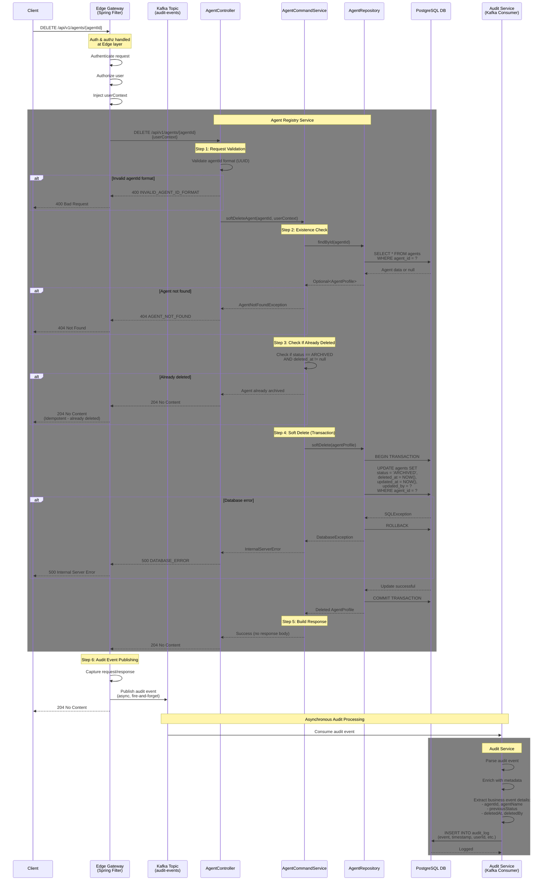

# [V1] Soft Delete Agent Profile API

## Overview

**Endpoint**: `DELETE /api/v1/agents/{agentId}`
**Purpose**: Soft delete an agent profile by marking it as ARCHIVED
**Version**: 1.0.0
**Last Updated**: 2026-01-11

This API performs a soft delete of an agent profile by setting its status to ARCHIVED and recording the deletion timestamp. The agent data is preserved in the database for audit and recovery purposes. This operation is idempotent - deleting an already archived agent is a no-op that returns success.

---

## Processing Rule - Sequence Diagram

### Full Request Flow

This diagram illustrates the complete processing flow for soft deleting an agent profile, including all validation steps, business logic, and data persistence operations.



---

## Processing Steps Summary (Pseudocode)

### Edge Layer - Spring Filter (Audit Event Publishing)

```pseudocode
CLASS AuditFilter EXTENDS OncePerRequestFilter:

    FUNCTION doFilterInternal(request, response, filterChain):
        // Wrap request and response to capture data
        wrappedRequest = new ContentCachingRequestWrapper(request)
        wrappedResponse = new ContentCachingResponseWrapper(response)

        startTime = getCurrentTimestamp()

        TRY:
            // Continue with the filter chain
            filterChain.doFilter(wrappedRequest, wrappedResponse)
        FINALLY:
            // After request is processed, publish audit event
            endTime = getCurrentTimestamp()

            auditEvent = {
                eventId: generateUUID(),
                eventType: "API_REQUEST",
                timestamp: startTime,
                duration: endTime - startTime,
                method: request.getMethod(),
                endpoint: request.getRequestURI(),
                statusCode: response.getStatus(),
                userId: extractUserIdFromContext(),
                tenantId: extractTenantIdFromContext(),
                requestBody: wrappedRequest.getContentAsString(),
                responseBody: wrappedResponse.getContentAsString(),
                ipAddress: request.getRemoteAddr(),
                userAgent: request.getHeader("User-Agent")
            }

            // Publish to Kafka asynchronously (fire-and-forget)
            kafkaTemplate.send("audit-events", auditEvent)

            // Copy response back to original response
            wrappedResponse.copyBodyToResponse()
        END TRY
    END FUNCTION

END CLASS
```

### Agent Registry Service - Main Processing Logic

```pseudocode
FUNCTION softDeleteAgent(agentId, userContext):
    // Note: Authentication & Authorization handled at Edge layer
    // userContext is pre-validated and injected by Edge Gateway
    // Audit logging handled asynchronously by Edge Filter -> Kafka -> Audit Consumer

    // Step 1: Request Validation
    IF NOT isValidUUID(agentId):
        THROW ValidationException("INVALID_AGENT_ID_FORMAT", 400)

    // Step 2: Existence Check
    existingAgent = agentRepository.findById(agentId)
    IF existingAgent IS NULL:
        THROW AgentNotFoundException("AGENT_NOT_FOUND", 404)

    // Step 3: Check If Already Deleted (Idempotency)
    IF existingAgent.status == ARCHIVED AND existingAgent.deletedAt IS NOT NULL:
        LOG("Agent already soft deleted: " + agentId)
        RETURN HTTP 204 No Content  // Idempotent - already deleted

    // Step 4: Soft Delete (Transaction)
    TRY:
        BEGIN TRANSACTION

        softDeletedAgent = {
            agentId: agentId,
            name: existingAgent.name,
            description: existingAgent.description,
            version: existingAgent.version,
            status: AgentStatus.ARCHIVED,              // Set to ARCHIVED
            domain: existingAgent.domain,
            ownerId: existingAgent.ownerId,
            ownerType: existingAgent.ownerType,
            tags: existingAgent.tags,
            modelConfig: existingAgent.modelConfig,
            metadata: existingAgent.metadata,
            createdAt: existingAgent.createdAt,
            createdBy: existingAgent.createdBy,
            updatedAt: getCurrentTimestamp(),
            updatedBy: userContext.userId,
            deletedAt: getCurrentTimestamp()           // Record deletion timestamp
        }

        agentRepository.update(softDeletedAgent)

        COMMIT TRANSACTION

    CATCH SQLException as error:
        ROLLBACK TRANSACTION
        LOG_ERROR("Database error soft deleting agent: " + error)
        THROW DatabaseException("DATABASE_ERROR", 500)
    END TRY

    // Step 5: Build Response
    LOG("Successfully soft deleted agent: " + agentId)
    RETURN HTTP 204 No Content

END FUNCTION
```

### Audit Service - Kafka Consumer

```pseudocode
CLASS AuditEventConsumer:

    @KafkaListener(topics = "audit-events", groupId = "audit-service-group")
    FUNCTION consumeAuditEvent(auditEvent):
        // Step 6: Asynchronous Audit Processing

        TRY:
            // Parse and enrich audit event
            enrichedEvent = {
                ...auditEvent,
                processedAt: getCurrentTimestamp(),
                environment: getEnvironment(),
                region: getRegion()
            }

            // Extract business event details if applicable
            IF enrichedEvent.endpoint MATCHES "/api/v1/agents/{agentId}" AND enrichedEvent.method == "DELETE":
                enrichedEvent.businessEventType = "AGENT_SOFT_DELETED"

                // Extract agentId from path
                agentId = extractFromPath(enrichedEvent.endpoint, "agentId")

                // Fetch agent details for audit log
                agentDetails = database.query("SELECT name, status, deleted_at FROM agents WHERE agent_id = ?", agentId)

                enrichedEvent.businessEventDetails = {
                    agentId: agentId,
                    agentName: agentDetails.name,
                    previousStatus: agentDetails.previousStatus,
                    newStatus: "ARCHIVED",
                    deletedAt: agentDetails.deleted_at,
                    deletedBy: enrichedEvent.userId
                }

            // Persist to audit log database
            database.insert("audit_log", enrichedEvent)

            LOG("Audit event processed successfully: " + enrichedEvent.eventId)

        CATCH Exception as error:
            // Log error and send to dead letter queue for retry
            LOG_ERROR("Failed to process audit event: " + error)
            kafkaTemplate.send("audit-events-dlq", auditEvent)
        END TRY

    END FUNCTION

END CLASS
```

---

## Key Validation Rules

| Rule | Description | Error Code |
|------|-------------|------------|
| Valid UUID | agentId must be valid UUID format | INVALID_AGENT_ID_FORMAT (400) |
| Agent Exists | Agent with given agentId must exist in database | AGENT_NOT_FOUND (404) |
| Idempotent Delete | If agent already ARCHIVED with deleted_at, return 204 (success) | N/A (204 No Content) |

---

## Database Transactions

### Single Transaction Scope

The soft delete operation is wrapped in a single ACID transaction to ensure data consistency:

```sql
-- Transaction Start
BEGIN TRANSACTION;

-- Soft Delete: Update agent status and deletion timestamp
UPDATE agents
SET
    status = 'ARCHIVED',
    deleted_at = NOW(),
    updated_at = NOW(),
    updated_by = ?
WHERE agent_id = ?;

-- Transaction End
COMMIT;
```

### Database Schema Addition

**Note**: The `deleted_at` field must be added to the agents table schema:

```sql
-- Add deleted_at column to agents table (if not exists)
ALTER TABLE agents
ADD COLUMN deleted_at TIMESTAMP NULL;

-- Create index for querying deleted agents
CREATE INDEX idx_agents_deleted_at ON agents(deleted_at);
```

### Failure Handling

**Transaction Rollback:**
- If any database error occurs during the UPDATE operation, the entire transaction is rolled back
- Returns 500 DATABASE_ERROR to client
- Agent status and deleted_at remain unchanged

**Idempotency:**
- If agent is already ARCHIVED with deleted_at timestamp, the API returns 204 No Content
- No database operation is performed (no-op)
- This ensures safe retries without side effects

---

## Timing Expectations

### Synchronous Request Flow

| Step | Typical Duration | Timeout |
|------|------------------|---------|
| Edge Layer Processing (Auth/Authz) | 20-50ms | 5s |
| Request Validation | 5-10ms | 2s |
| Existence Check (DB SELECT) | 20-50ms | 5s |
| Idempotency Check | 5-10ms | 1s |
| Database Soft Delete (Transaction) | 30-80ms | 10s |
| Build Response | 5-10ms | 1s |
| Edge Filter - Kafka Publish | 5-10ms | 1s |
| **Total Request** | **90-220ms** | **30s** |

### Asynchronous Audit Processing

| Step | Typical Duration | Notes |
|------|------------------|-------|
| Kafka Event Delivery | 10-50ms | Async, does not block request |
| Audit Consumer Processing | 50-100ms | Independent from request flow |
| Database Audit Log Insert | 20-50ms | Separate transaction |
| **Total Audit Processing** | **80-200ms** | Fire-and-forget from client perspective |

---

## Audit Architecture Pattern

### Event-Driven Audit Logging

This API implements an event-driven audit pattern using Kafka for asynchronous, non-blocking audit logging:

**Benefits:**
- **Decoupled**: Audit logging is completely decoupled from business logic
- **Non-blocking**: Audit failures don't impact API response times or availability
- **Centralized**: All API requests are audited consistently at the Edge layer
- **Scalable**: Kafka provides horizontal scalability for high-volume audit events
- **Resilient**: Dead letter queue (DLQ) handles failed audit events for retry

**Architecture Components:**

1. **Edge Gateway - Spring Filter** (`AuditFilter`)
   - Extends `OncePerRequestFilter` in Spring Boot
   - Wraps request/response using `ContentCachingRequestWrapper` and `ContentCachingResponseWrapper`
   - Captures full request/response payload, headers, and metadata
   - Publishes audit events to Kafka topic `audit-events` asynchronously
   - Fire-and-forget pattern - doesn't wait for Kafka confirmation

2. **Kafka Topic** (`audit-events`)
   - Message broker for audit events
   - Provides durability, ordering, and replay capabilities
   - Supports multiple consumers for different audit use cases
   - Configured with appropriate retention policy

3. **Audit Service - Kafka Consumer** (`AuditEventConsumer`)
   - Consumes events from `audit-events` topic
   - Enriches events with additional metadata (environment, region, etc.)
   - Extracts business event details from request/response payloads
   - Persists to `audit_log` database table
   - Sends failed events to `audit-events-dlq` for retry

**Event Schema:**

```json
{
  "eventId": "uuid",
  "eventType": "API_REQUEST",
  "timestamp": "2026-01-11T12:00:00Z",
  "duration": 150,
  "method": "DELETE",
  "endpoint": "/api/v1/agents/550e8400-e29b-41d4-a716-446655440000",
  "statusCode": 204,
  "userId": "user-123",
  "tenantId": "tenant-456",
  "requestBody": "",
  "responseBody": "",
  "ipAddress": "192.168.1.1",
  "userAgent": "Mozilla/5.0...",
  "businessEventType": "AGENT_SOFT_DELETED",
  "businessEventDetails": {
    "agentId": "550e8400-e29b-41d4-a716-446655440000",
    "agentName": "ecommerce-support-bot",
    "previousStatus": "ACTIVE",
    "newStatus": "ARCHIVED",
    "deletedAt": "2026-01-11T14:25:30Z",
    "deletedBy": "user-123"
  }
}
```

---

## Request & Response Schemas

### Request Schema

**DELETE /api/v1/agents/{agentId}**

Path Parameters:
- `agentId` (string, required): UUID of the agent to soft delete

**No request body required for DELETE operations**

**Example Request:**

```bash
DELETE /api/v1/agents/550e8400-e29b-41d4-a716-446655440000
```

### Success Response

**204 No Content** - Agent soft deleted successfully

No response body is returned for successful DELETE operations per REST conventions.

**Response Headers:**
```
HTTP/1.1 204 No Content
Date: Sat, 11 Jan 2026 14:25:30 GMT
```

**Idempotent Response:**
If the agent is already soft deleted (status = ARCHIVED and deleted_at is not null), the API still returns 204 No Content, ensuring idempotency.

### Error Responses

**400 Bad Request** - Invalid agent ID format

```json
{
  "errorCode": "INVALID_AGENT_ID_FORMAT",
  "message": "Agent ID must be a valid UUID format",
  "timestamp": "2026-01-11T14:25:30Z",
  "path": "/api/v1/agents/invalid-id"
}
```

**404 Not Found** - Agent doesn't exist

```json
{
  "errorCode": "AGENT_NOT_FOUND",
  "message": "Agent not found with ID: 550e8400-e29b-41d4-a716-446655440000",
  "timestamp": "2026-01-11T14:25:30Z",
  "path": "/api/v1/agents/550e8400-e29b-41d4-a716-446655440000"
}
```

**500 Internal Server Error** - Database error

```json
{
  "errorCode": "DATABASE_ERROR",
  "message": "An error occurred while soft deleting the agent",
  "timestamp": "2026-01-11T14:25:30Z",
  "path": "/api/v1/agents/550e8400-e29b-41d4-a716-446655440000"
}
```

---

## Soft Delete vs Hard Delete

### Soft Delete (This API)
- ✅ **Preserves data** for audit and recovery
- ✅ **Supports restore** operations if needed
- ✅ **Maintains referential integrity** with related tables
- ✅ **Compliance-friendly** for regulatory requirements
- ✅ **Safer** - can be undone if deleted by mistake

**Implementation:**
- Sets `status = 'ARCHIVED'`
- Sets `deleted_at = NOW()`
- Agent remains in database with all data intact

### Hard Delete (Not Implemented)
- ❌ **Permanently removes** data from database
- ❌ **Cannot be recovered** after deletion
- ❌ **May break** foreign key constraints
- ❌ **Compliance risks** for audit trails
- ❌ **Dangerous** - cannot be undone

**Would use:**
- `DELETE FROM agents WHERE agent_id = ?`
- Cascading deletes via `ON DELETE CASCADE`

---

## Querying Soft Deleted Agents

### Exclude Soft Deleted Agents (Default Behavior)

```sql
-- Get all active agents (exclude soft deleted)
SELECT * FROM agents
WHERE status != 'ARCHIVED'
  OR deleted_at IS NULL;

-- Get all non-deleted agents with specific status
SELECT * FROM agents
WHERE status = 'ACTIVE'
  AND deleted_at IS NULL;
```

### Include Only Soft Deleted Agents

```sql
-- Get all soft deleted agents
SELECT * FROM agents
WHERE status = 'ARCHIVED'
  AND deleted_at IS NOT NULL;
```

### Include All Agents (Deleted and Non-Deleted)

```sql
-- Get all agents regardless of deletion status
SELECT * FROM agents;
```

---

## Restore Operation (Future Enhancement)

While not implemented in this API, a restore operation could be added:

**Endpoint**: `POST /api/v1/agents/{agentId}/restore`

**Operation:**
```sql
UPDATE agents
SET
    status = ?,              -- Restore to previous status or set to INACTIVE
    deleted_at = NULL,       -- Clear deletion timestamp
    updated_at = NOW(),
    updated_by = ?
WHERE agent_id = ?
  AND status = 'ARCHIVED'
  AND deleted_at IS NOT NULL;
```

---

## Best Practices

### For API Consumers

1. **Handle 204 Response**: DELETE operations return no response body
2. **Implement Retry Logic**: DELETE is idempotent, safe to retry on failure
3. **Check Before Delete**: Optionally GET agent first to confirm existence
4. **User Confirmation**: Always ask user to confirm before deleting
5. **Provide Undo**: Consider implementing restore functionality

### For API Implementers

1. **Always Soft Delete**: Use soft delete for critical data like agents
2. **Audit Trail**: Ensure all deletions are logged for compliance
3. **Idempotency**: Support safe retries by checking deletion status
4. **Transaction Safety**: Wrap in transaction to ensure data consistency
5. **Authorization**: Verify user has permission to delete the agent

---

## Authorization Considerations

**Recommended Authorization Rules:**

1. **Owner Check**: Only agent owner can delete the agent
2. **Admin Override**: System admins can delete any agent
3. **Team Permission**: Team members with delete permission can delete team-owned agents
4. **Status Check** (Optional): Prevent deletion of certain statuses (e.g., ACTIVE agents in production)

**Example Authorization Logic:**

```java
// In AgentCommandService
public void softDeleteAgent(String agentId, UserContext userContext) {
    AgentProfile agent = agentRepository.findById(agentId)
        .orElseThrow(() -> new AgentNotFoundException(agentId));

    // Check authorization
    if (!canDeleteAgent(agent, userContext)) {
        throw new ForbiddenException("User does not have permission to delete this agent");
    }

    // Proceed with soft delete
    // ...
}

private boolean canDeleteAgent(AgentProfile agent, UserContext userContext) {
    // Owner can delete
    if (agent.getOwnerId().equals(userContext.getUserId())) {
        return true;
    }

    // Admin can delete
    if (userContext.hasRole("ADMIN")) {
        return true;
    }

    // Team member with delete permission
    if (agent.getOwnerType().equals("TEAM")) {
        return teamService.hasPermission(userContext.getUserId(), agent.getOwnerId(), "DELETE_AGENT");
    }

    return false;
}
```

---

**Last Updated**: 2026-01-11
**Version**: 1.0.0
