# [V1] Update Agent Profile API

## Overview

**Endpoint**: `PUT /api/v1/agents/{agentId}`
**Purpose**: Update an existing agent profile with new configuration
**Version**: 1.0.0
**Last Updated**: 2026-01-11

This API performs a full replacement of an agent profile by its unique identifier. It validates all inputs including tag references, name uniqueness, and model configuration before persisting changes. The update is wrapped in a single database transaction to ensure data consistency. All fields (name, description, version, status, domain, model configuration, tags, and metadata) can be updated in a single request.

---

## Processing Rule - Sequence Diagram

### Full Request Flow

This diagram illustrates the complete processing flow for updating an agent profile, including all validation steps, business logic, and data persistence operations.

```mermaid
sequenceDiagram
    participant Client
    participant Edge as Edge Gateway<br/>(Spring Filter)
    participant Kafka as Kafka Topic<br/>(audit-events)
    participant Controller as AgentController
    participant Service as AgentService
    participant TagService as TagService
    participant Repository as AgentRepository
    participant Database as PostgreSQL DB
    participant AuditConsumer as Audit Service<br/>(Kafka Consumer)

    Client->>Edge: PUT /api/v1/agents/{agentId}<br/>{UpdateAgentRequest}

    Note over Edge: Auth & authz handled<br/>at Edge layer
    Edge->>Edge: Authenticate request
    Edge->>Edge: Authorize user
    Edge->>Edge: Inject userContext

    rect rgba(0, 0, 0, 0.5)
    Note over Controller,Repository: Agent Registry Service

    Edge->>Controller: PUT /api/v1/agents/{agentId}<br/>{userContext, request}

    Note over Controller: Step 1: Request Validation
    Controller->>Controller: Validate agentId format (UUID)
    Controller->>Controller: Validate request schema
    Controller->>Controller: Validate required fields
    alt Invalid agentId format
        Controller-->>Edge: 400 INVALID_AGENT_ID_FORMAT
        Edge-->>Client: 400 Bad Request
    else Invalid request schema
        Controller-->>Edge: 400 INVALID_REQUEST_SCHEMA
        Edge-->>Client: 400 Bad Request
    end

    Controller->>Service: updateAgent(agentId, request, userContext)

    Note over Service: Step 2: Existence Check
    Service->>Repository: findById(agentId)
    Repository->>Database: SELECT * FROM agents<br/>WHERE agent_id = ?
    Database-->>Repository: Agent data or null
    Repository-->>Service: Optional<AgentProfile>
    alt Agent not found
        Service-->>Controller: AgentNotFoundException
        Controller-->>Edge: 404 AGENT_NOT_FOUND
        Edge-->>Client: 404 Not Found
    end

    Note over Service: Step 3: Name Uniqueness Check
    Service->>Repository: findByName(newName)
    Repository->>Database: SELECT agent_id FROM agents<br/>WHERE name = ? AND agent_id != ?
    Database-->>Repository: Result set
    Repository-->>Service: Optional<AgentProfile>
    alt Name already exists (different agent)
        Service-->>Controller: AgentNameConflictException
        Controller-->>Edge: 409 AGENT_NAME_ALREADY_EXISTS
        Edge-->>Client: 409 Conflict
    end

    Note over Service: Step 4: Tag Validation
    Service->>TagService: validateTagIds(tags)
    TagService->>Database: SELECT tag_id FROM agent_tags<br/>WHERE tag_id = ANY(?) AND is_active = true
    Database-->>TagService: Valid tag_ids
    alt Invalid or inactive tags
        TagService-->>Service: InvalidTagException
        Service-->>Controller: ValidationException
        Controller-->>Edge: 400 INVALID_TAG_IDS
        Edge-->>Client: 400 Bad Request
    end

    Note over Service: Step 5: Model Config Validation
    Service->>Service: Validate model_config structure
    Service->>Service: Check provider, modelId, temperature
    alt Invalid model config
        Service-->>Controller: ValidationException
        Controller-->>Edge: 400 INVALID_MODEL_CONFIG
        Edge-->>Client: 400 Bad Request
    end

    Note over Service: Step 6: Database Update (Transaction)
    Service->>Repository: update(agentProfile)
    Repository->>Database: BEGIN TRANSACTION
    Repository->>Database: UPDATE agents SET<br/>name = ?, description = ?, version = ?,<br/>status = ?, domain = ?, model_config = ?,<br/>tags = ?, metadata = ?,<br/>updated_at = ?, updated_by = ?<br/>WHERE agent_id = ?
    alt Database error
        Database-->>Repository: SQLException
        Repository->>Database: ROLLBACK
        Repository-->>Service: DatabaseException
        Service-->>Controller: InternalServerError
        Controller-->>Edge: 500 DATABASE_ERROR
        Edge-->>Client: 500 Internal Server Error
    end
    Database-->>Repository: Update successful
    Repository->>Database: COMMIT TRANSACTION
    Repository-->>Service: Updated AgentProfile

    Note over Service: Step 7: Update Tag Usage Counts
    Service->>TagService: updateTagUsageCounts(oldTags, newTags)
    TagService->>Database: UPDATE agent_tags SET usage_count = usage_count - 1<br/>WHERE tag_id = ANY(removedTags)
    TagService->>Database: UPDATE agent_tags SET usage_count = usage_count + 1<br/>WHERE tag_id = ANY(addedTags)
    Database-->>TagService: Updated

    Note over Service: Step 8: Build Response
    Service-->>Controller: UpdatedAgentProfile
    Controller->>Controller: Map to AgentProfileDTO
    Controller-->>Edge: 200 OK<br/>{AgentProfileDTO}

    end

    Note over Edge: Step 9: Audit Event Publishing
    Edge->>Edge: Capture request/response
    Edge->>Kafka: Publish audit event<br/>(async, fire-and-forget)
    Edge-->>Client: 200 OK<br/>{AgentProfileDTO}

    Note over Kafka,AuditConsumer: Asynchronous Audit Processing
    Kafka->>AuditConsumer: Consume audit event

    rect rgba(0, 0, 0, 0.5)
    Note over AuditConsumer: Audit Service
    AuditConsumer->>AuditConsumer: Parse audit event
    AuditConsumer->>AuditConsumer: Enrich with metadata
    AuditConsumer->>AuditConsumer: Extract business event details:<br/>- agentId, agentName<br/>- fieldsUpdated<br/>- oldValues, newValues
    AuditConsumer->>Database: INSERT INTO audit_log<br/>(event, timestamp, userId, etc.)
    Database-->>AuditConsumer: Logged
    end
```



---

## Processing Steps Summary (Pseudocode)

### Edge Layer - Spring Filter (Audit Event Publishing)

```pseudocode
CLASS AuditFilter EXTENDS OncePerRequestFilter:

    FUNCTION doFilterInternal(request, response, filterChain):
        // Wrap request and response to capture data
        wrappedRequest = new ContentCachingRequestWrapper(request)
        wrappedResponse = new ContentCachingResponseWrapper(response)

        startTime = getCurrentTimestamp()

        TRY:
            // Continue with the filter chain
            filterChain.doFilter(wrappedRequest, wrappedResponse)
        FINALLY:
            // After request is processed, publish audit event
            endTime = getCurrentTimestamp()

            auditEvent = {
                eventId: generateUUID(),
                eventType: "API_REQUEST",
                timestamp: startTime,
                duration: endTime - startTime,
                method: request.getMethod(),
                endpoint: request.getRequestURI(),
                statusCode: response.getStatus(),
                userId: extractUserIdFromContext(),
                tenantId: extractTenantIdFromContext(),
                requestBody: wrappedRequest.getContentAsString(),
                responseBody: wrappedResponse.getContentAsString(),
                ipAddress: request.getRemoteAddr(),
                userAgent: request.getHeader("User-Agent")
            }

            // Publish to Kafka asynchronously (fire-and-forget)
            kafkaTemplate.send("audit-events", auditEvent)

            // Copy response back to original response
            wrappedResponse.copyBodyToResponse()
        END TRY
    END FUNCTION

END CLASS
```

### Agent Registry Service - Main Processing Logic

```pseudocode
FUNCTION updateAgentProfile(agentId, request, userContext):
    // Note: Authentication & Authorization handled at Edge layer
    // userContext is pre-validated and injected by Edge Gateway
    // Audit logging handled asynchronously by Edge Filter -> Kafka -> Audit Consumer

    // Step 1: Request Validation
    IF NOT isValidUUID(agentId):
        THROW ValidationException("INVALID_AGENT_ID_FORMAT", 400)

    IF NOT isValidRequestSchema(request):
        THROW ValidationException("INVALID_REQUEST_SCHEMA", 400)

    IF request.name IS EMPTY OR request.version IS EMPTY OR request.status IS EMPTY:
        THROW ValidationException("MISSING_REQUIRED_FIELDS", 400)

    // Step 2: Existence Check
    existingAgent = agentRepository.findById(agentId)
    IF existingAgent IS NULL:
        THROW AgentNotFoundException("AGENT_NOT_FOUND", 404)

    // Step 3: Name Uniqueness Check (if name is being changed)
    IF request.name != existingAgent.name:
        conflictingAgent = agentRepository.findByName(request.name)
        IF conflictingAgent EXISTS AND conflictingAgent.agentId != agentId:
            THROW AgentNameConflictException("AGENT_NAME_ALREADY_EXISTS", 409)

    // Step 4: Tag Validation
    IF request.tags IS NOT EMPTY:
        validTags = tagService.validateTagIds(request.tags)
        IF validTags.size() != request.tags.size():
            invalidTags = request.tags - validTags
            THROW InvalidTagException("INVALID_TAG_IDS: " + invalidTags, 400)

    // Step 5: Model Config Validation
    IF request.modelConfig IS NOT NULL:
        IF request.modelConfig.provider IS EMPTY:
            THROW ValidationException("INVALID_MODEL_CONFIG: provider required", 400)
        IF request.modelConfig.modelId IS EMPTY:
            THROW ValidationException("INVALID_MODEL_CONFIG: modelId required", 400)
        IF request.modelConfig.temperature IS NOT NULL:
            IF request.modelConfig.temperature < 0.0 OR request.modelConfig.temperature > 1.0:
                THROW ValidationException("INVALID_MODEL_CONFIG: temperature must be 0.0-1.0", 400)

    // Step 6: Database Update (Transaction)
    TRY:
        BEGIN TRANSACTION

        updatedAgent = {
            agentId: agentId,
            name: request.name,
            description: request.description,
            version: request.version,
            status: request.status,
            domain: request.domain,
            ownerId: existingAgent.ownerId,              // Preserve ownership
            ownerType: existingAgent.ownerType,          // Preserve ownership
            tags: request.tags,
            modelConfig: request.modelConfig,
            metadata: request.metadata,
            createdAt: existingAgent.createdAt,          // Preserve creation timestamp
            createdBy: existingAgent.createdBy,          // Preserve creator
            updatedAt: getCurrentTimestamp(),
            updatedBy: userContext.userId
        }

        agentRepository.update(updatedAgent)

        COMMIT TRANSACTION

    CATCH SQLException as error:
        ROLLBACK TRANSACTION
        LOG_ERROR("Database error updating agent: " + error)
        THROW DatabaseException("DATABASE_ERROR", 500)
    END TRY

    // Step 7: Update Tag Usage Counts
    oldTags = existingAgent.tags
    newTags = request.tags

    removedTags = oldTags - newTags
    addedTags = newTags - oldTags

    IF removedTags IS NOT EMPTY:
        tagService.decrementUsage(removedTags)

    IF addedTags IS NOT EMPTY:
        tagService.incrementUsage(addedTags)

    // Step 8: Build Response
    response = mapToAgentProfileDTO(updatedAgent)

    RETURN HTTP 200 OK with response

END FUNCTION
```

### Audit Service - Kafka Consumer

```pseudocode
CLASS AuditEventConsumer:

    @KafkaListener(topics = "audit-events", groupId = "audit-service-group")
    FUNCTION consumeAuditEvent(auditEvent):
        // Step 9: Asynchronous Audit Processing

        TRY:
            // Parse and enrich audit event
            enrichedEvent = {
                ...auditEvent,
                processedAt: getCurrentTimestamp(),
                environment: getEnvironment(),
                region: getRegion()
            }

            // Extract business event details if applicable
            IF enrichedEvent.endpoint MATCHES "/api/v1/agents/{agentId}" AND enrichedEvent.method == "PUT":
                enrichedEvent.businessEventType = "AGENT_PROFILE_UPDATED"

                requestBody = parseJSON(enrichedEvent.requestBody)
                responseBody = parseJSON(enrichedEvent.responseBody)

                enrichedEvent.businessEventDetails = {
                    agentId: extractFromPath(enrichedEvent.endpoint),
                    agentName: requestBody.name,
                    fieldsUpdated: getChangedFields(requestBody),
                    oldValues: getPreviousValues(agentId),
                    newValues: requestBody
                }

            // Persist to audit log database
            database.insert("audit_log", enrichedEvent)

            LOG("Audit event processed successfully: " + enrichedEvent.eventId)

        CATCH Exception as error:
            // Log error and send to dead letter queue for retry
            LOG_ERROR("Failed to process audit event: " + error)
            kafkaTemplate.send("audit-events-dlq", auditEvent)
        END TRY

    END FUNCTION

END CLASS
```

---

## Key Validation Rules

| Rule | Description | Error Code |
|------|-------------|------------|
| Valid UUID | agentId must be valid UUID format | INVALID_AGENT_ID_FORMAT (400) |
| Agent Exists | Agent with given agentId must exist in database | AGENT_NOT_FOUND (404) |
| Unique Name | Agent name must be unique (if changed from existing name) | AGENT_NAME_ALREADY_EXISTS (409) |
| Required Fields | name, version, status are required | MISSING_REQUIRED_FIELDS (400) |
| Valid Status | status must be one of: DRAFT, ACTIVE, INACTIVE, ARCHIVED | INVALID_STATUS (400) |
| Valid Tags | All tag_ids must exist in agent_tags and be active | INVALID_TAG_IDS (400) |
| Valid Model Config | Provider and modelId required if model_config provided | INVALID_MODEL_CONFIG (400) |
| Valid Temperature | Temperature must be between 0.0 and 1.0 | INVALID_MODEL_CONFIG (400) |
| Request Schema | Request body must match UpdateAgentRequest schema | INVALID_REQUEST_SCHEMA (400) |

---

## Database Transactions

### Single Transaction Scope

All database modifications are wrapped in a single ACID transaction to ensure data consistency:

```sql
-- Transaction Start
BEGIN TRANSACTION;

-- Main Update: Update agent profile
UPDATE agents
SET
    name = ?,
    description = ?,
    version = ?,
    status = ?,
    domain = ?,
    model_config = ?::jsonb,
    tags = ?::jsonb,
    metadata = ?::jsonb,
    updated_at = NOW(),
    updated_by = ?
WHERE agent_id = ?;

-- Transaction End
COMMIT;
```

### Separate Operations (After Transaction Commit)

Tag usage count updates are performed separately after the main transaction succeeds:

```sql
-- Decrement usage count for removed tags
UPDATE agent_tags
SET usage_count = usage_count - 1
WHERE tag_id = ANY(?);

-- Increment usage count for added tags
UPDATE agent_tags
SET usage_count = usage_count + 1
WHERE tag_id = ANY(?);
```

### Failure Handling

**Transaction Rollback:**
- If any database error occurs during the UPDATE operation, the entire transaction is rolled back
- Returns 500 DATABASE_ERROR to client
- No partial updates are persisted

**Tag Usage Count Failures:**
- If tag usage count updates fail, they are logged but don't affect the response
- Tag usage counts are eventually consistent (can be recalculated if needed)

---

## Timing Expectations

### Synchronous Request Flow

| Step | Typical Duration | Timeout |
|------|------------------|---------|
| Edge Layer Processing (Auth/Authz) | 20-50ms | 5s |
| Request Validation | 10-20ms | 2s |
| Existence Check (DB SELECT) | 20-50ms | 5s |
| Name Uniqueness Check (DB SELECT) | 20-50ms | 5s |
| Tag Validation (DB SELECT) | 30-80ms | 5s |
| Model Config Validation | 5-10ms | 1s |
| Database Update (Transaction) | 50-150ms | 10s |
| Tag Usage Count Updates | 30-80ms | 5s |
| Response Building | 10-20ms | 1s |
| Edge Filter - Kafka Publish | 5-10ms | 1s |
| **Total Request** | **200-520ms** | **30s** |

### Asynchronous Audit Processing

| Step | Typical Duration | Notes |
|------|------------------|-------|
| Kafka Event Delivery | 10-50ms | Async, does not block request |
| Audit Consumer Processing | 50-100ms | Independent from request flow |
| Database Audit Log Insert | 20-50ms | Separate transaction |
| **Total Audit Processing** | **80-200ms** | Fire-and-forget from client perspective |

---

## Audit Architecture Pattern

### Event-Driven Audit Logging

This API implements an event-driven audit pattern using Kafka for asynchronous, non-blocking audit logging:

**Benefits:**
- **Decoupled**: Audit logging is completely decoupled from business logic
- **Non-blocking**: Audit failures don't impact API response times or availability
- **Centralized**: All API requests are audited consistently at the Edge layer
- **Scalable**: Kafka provides horizontal scalability for high-volume audit events
- **Resilient**: Dead letter queue (DLQ) handles failed audit events for retry

**Architecture Components:**

1. **Edge Gateway - Spring Filter** (`AuditFilter`)
   - Extends `OncePerRequestFilter` in Spring Boot
   - Wraps request/response using `ContentCachingRequestWrapper` and `ContentCachingResponseWrapper`
   - Captures full request/response payload, headers, and metadata
   - Publishes audit events to Kafka topic `audit-events` asynchronously
   - Fire-and-forget pattern - doesn't wait for Kafka confirmation

2. **Kafka Topic** (`audit-events`)
   - Message broker for audit events
   - Provides durability, ordering, and replay capabilities
   - Supports multiple consumers for different audit use cases
   - Configured with appropriate retention policy

3. **Audit Service - Kafka Consumer** (`AuditEventConsumer`)
   - Consumes events from `audit-events` topic
   - Enriches events with additional metadata (environment, region, etc.)
   - Extracts business event details from request/response payloads
   - Persists to `audit_log` database table
   - Sends failed events to `audit-events-dlq` for retry

**Event Schema:**

```json
{
  "eventId": "uuid",
  "eventType": "API_REQUEST",
  "timestamp": "2026-01-11T12:00:00Z",
  "duration": 350,
  "method": "PUT",
  "endpoint": "/api/v1/agents/{agentId}",
  "statusCode": 200,
  "userId": "user-123",
  "tenantId": "tenant-456",
  "requestBody": "{...}",
  "responseBody": "{...}",
  "ipAddress": "192.168.1.1",
  "userAgent": "Mozilla/5.0...",
  "businessEventType": "AGENT_PROFILE_UPDATED",
  "businessEventDetails": {
    "agentId": "550e8400-e29b-41d4-a716-446655440000",
    "agentName": "ecommerce-support-bot-v2",
    "fieldsUpdated": ["name", "description", "version", "modelConfig", "tags"],
    "oldValues": {
      "name": "ecommerce-support-bot",
      "version": "1.0.0",
      "tags": ["tag-uuid-1", "tag-uuid-2"]
    },
    "newValues": {
      "name": "ecommerce-support-bot-v2",
      "version": "2.0.0",
      "tags": ["tag-uuid-1", "tag-uuid-3", "tag-uuid-4"]
    }
  }
}
```

---

## Request & Response Schemas

### Request Schema

**PUT /api/v1/agents/{agentId}**

Path Parameters:
- `agentId` (string, required): UUID of the agent to update

Request Body (`UpdateAgentRequest`):

```json
{
  "name": "ecommerce-support-bot-v2",
  "description": "Enhanced customer support bot for e-commerce platform with multi-language support",
  "version": "2.0.0",
  "status": "ACTIVE",
  "domain": "ecommerce",
  "tags": [
    "tag-550e8400-e29b-41d4-a716-446655440001",
    "tag-550e8400-e29b-41d4-a716-446655440003",
    "tag-550e8400-e29b-41d4-a716-446655440005",
    "tag-550e8400-e29b-41d4-a716-446655440007"
  ],
  "modelConfig": {
    "provider": "anthropic",
    "modelId": "claude-3-opus",
    "temperature": 0.8,
    "maxTokens": 8192,
    "additionalParams": {
      "topP": 0.95,
      "topK": 50
    }
  },
  "metadata": {
    "priority": 20,
    "maxConcurrentRequests": 200,
    "requestTimeout": "PT45S",
    "allowedUserRoles": ["admin", "operator", "customer"],
    "greetingMessage": "Hello! I'm your e-commerce assistant. How can I help you today?",
    "maxRetries": 5,
    "enableVerboseLogging": true,
    "specialInstructions": "Always be polite, professional, and prioritize customer satisfaction",
    "featureFlags": {
      "enableStreaming": true,
      "enableCaching": true,
      "enableMultiLanguage": true
    }
  }
}
```

**Field Specifications:**

| Field | Type | Required | Constraints |
|-------|------|----------|-------------|
| name | string | Yes | Must be unique, 1-255 chars |
| description | string | No | 0-2000 chars |
| version | string | Yes | Semantic version format (e.g., "1.0.0") |
| status | string | Yes | One of: DRAFT, ACTIVE, INACTIVE, ARCHIVED |
| domain | string | No | 0-100 chars |
| tags | array[string] | No | Array of valid tag UUIDs from agent_tags |
| modelConfig | object | No | Valid ModelConfig object |
| modelConfig.provider | string | Yes* | Required if modelConfig provided |
| modelConfig.modelId | string | Yes* | Required if modelConfig provided |
| modelConfig.temperature | number | No | 0.0 - 1.0 |
| modelConfig.maxTokens | integer | No | > 0 |
| modelConfig.additionalParams | object | No | Key-value pairs |
| metadata | object | No | Custom key-value pairs |

*Required if parent object is provided

### Success Response

**200 OK** - Agent profile updated successfully

```json
{
  "agentId": "550e8400-e29b-41d4-a716-446655440000",
  "name": "ecommerce-support-bot-v2",
  "description": "Enhanced customer support bot for e-commerce platform with multi-language support",
  "version": "2.0.0",
  "status": "ACTIVE",
  "domain": "ecommerce",
  "ownerId": "user-123",
  "ownerType": "USER",
  "tags": [
    {
      "tagId": "tag-550e8400-e29b-41d4-a716-446655440001",
      "tagName": "customer-support",
      "displayName": "Customer Support",
      "category": "CAPABILITY"
    },
    {
      "tagId": "tag-550e8400-e29b-41d4-a716-446655440003",
      "tagName": "refunds",
      "displayName": "Refunds",
      "category": "CAPABILITY"
    },
    {
      "tagId": "tag-550e8400-e29b-41d4-a716-446655440005",
      "tagName": "english",
      "displayName": "English",
      "category": "LANGUAGE"
    },
    {
      "tagId": "tag-550e8400-e29b-41d4-a716-446655440007",
      "tagName": "web-search",
      "displayName": "Web Search",
      "category": "TOOL"
    }
  ],
  "modelConfig": {
    "provider": "anthropic",
    "modelId": "claude-3-opus",
    "temperature": 0.8,
    "maxTokens": 8192,
    "additionalParams": {
      "topP": 0.95,
      "topK": 50
    }
  },
  "metadata": {
    "priority": 20,
    "maxConcurrentRequests": 200,
    "requestTimeout": "PT45S",
    "allowedUserRoles": ["admin", "operator", "customer"],
    "greetingMessage": "Hello! I'm your e-commerce assistant. How can I help you today?",
    "maxRetries": 5,
    "enableVerboseLogging": true,
    "specialInstructions": "Always be polite, professional, and prioritize customer satisfaction",
    "featureFlags": {
      "enableStreaming": true,
      "enableCaching": true,
      "enableMultiLanguage": true
    }
  },
  "createdAt": "2025-12-15T10:30:00Z",
  "updatedAt": "2026-01-11T14:25:30Z",
  "createdBy": "user-123",
  "updatedBy": "user-123"
}
```

### Error Responses

**400 Bad Request** - Validation error

```json
{
  "error": "INVALID_AGENT_ID_FORMAT",
  "message": "Agent ID must be a valid UUID format",
  "timestamp": "2026-01-11T14:25:30Z",
  "path": "/api/v1/agents/invalid-id"
}
```

```json
{
  "error": "INVALID_TAG_IDS",
  "message": "The following tag IDs are invalid or inactive: [tag-xxx-yyy-zzz]",
  "timestamp": "2026-01-11T14:25:30Z",
  "path": "/api/v1/agents/550e8400-e29b-41d4-a716-446655440000"
}
```

```json
{
  "error": "INVALID_MODEL_CONFIG",
  "message": "Temperature must be between 0.0 and 1.0",
  "timestamp": "2026-01-11T14:25:30Z",
  "path": "/api/v1/agents/550e8400-e29b-41d4-a716-446655440000"
}
```

**404 Not Found** - Agent doesn't exist

```json
{
  "error": "AGENT_NOT_FOUND",
  "message": "Agent with ID 550e8400-e29b-41d4-a716-446655440000 not found",
  "timestamp": "2026-01-11T14:25:30Z",
  "path": "/api/v1/agents/550e8400-e29b-41d4-a716-446655440000"
}
```

**409 Conflict** - Name already exists

```json
{
  "error": "AGENT_NAME_ALREADY_EXISTS",
  "message": "An agent with name 'ecommerce-support-bot-v2' already exists",
  "timestamp": "2026-01-11T14:25:30Z",
  "path": "/api/v1/agents/550e8400-e29b-41d4-a716-446655440000"
}
```

**500 Internal Server Error** - Database error

```json
{
  "error": "DATABASE_ERROR",
  "message": "An error occurred while updating the agent profile",
  "timestamp": "2026-01-11T14:25:30Z",
  "path": "/api/v1/agents/550e8400-e29b-41d4-a716-446655440000"
}
```

---

**Last Updated**: 2026-01-11
**Version**: 1.0.0
