# AI Agent Architecture - Mermaid Diagrams

## 1. Component Architecture Diagram

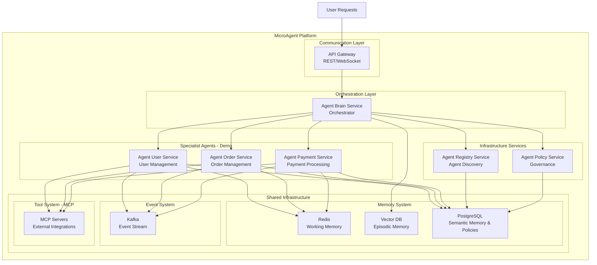

## 2. Data Flow Sequence Diagram

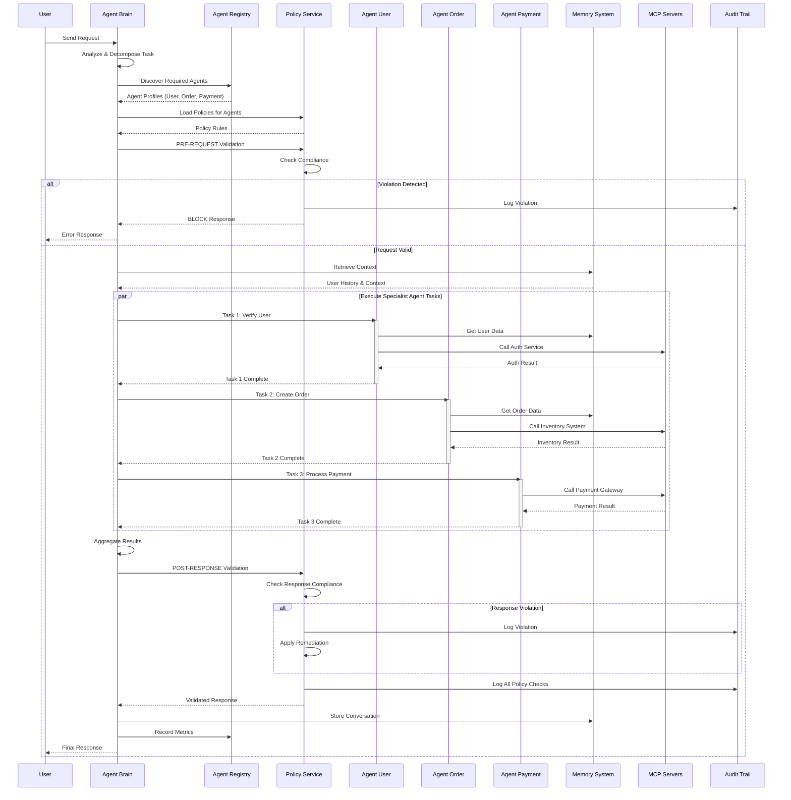

## 3. Memory System Architecture

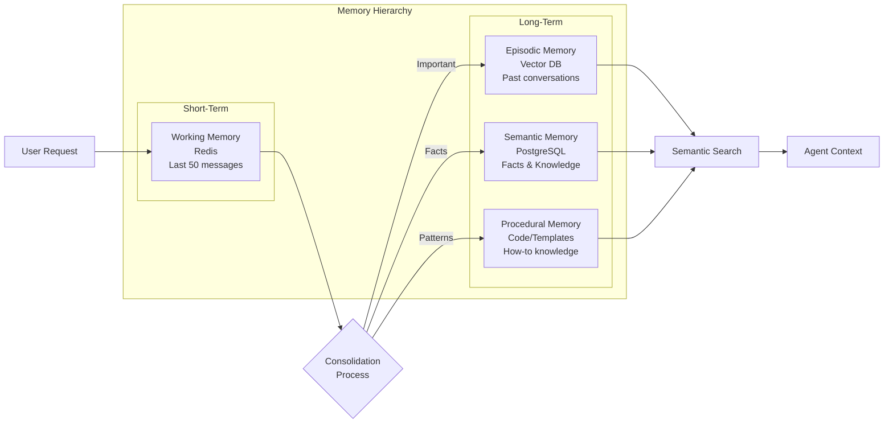

## 4. Tool/MCP Integration Architecture

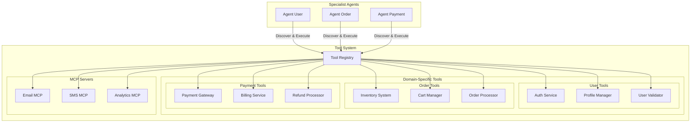

## 5. Agent Brain Orchestration Flow

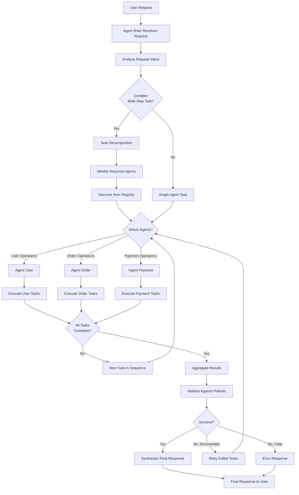

## 6. Communication Protocol Options

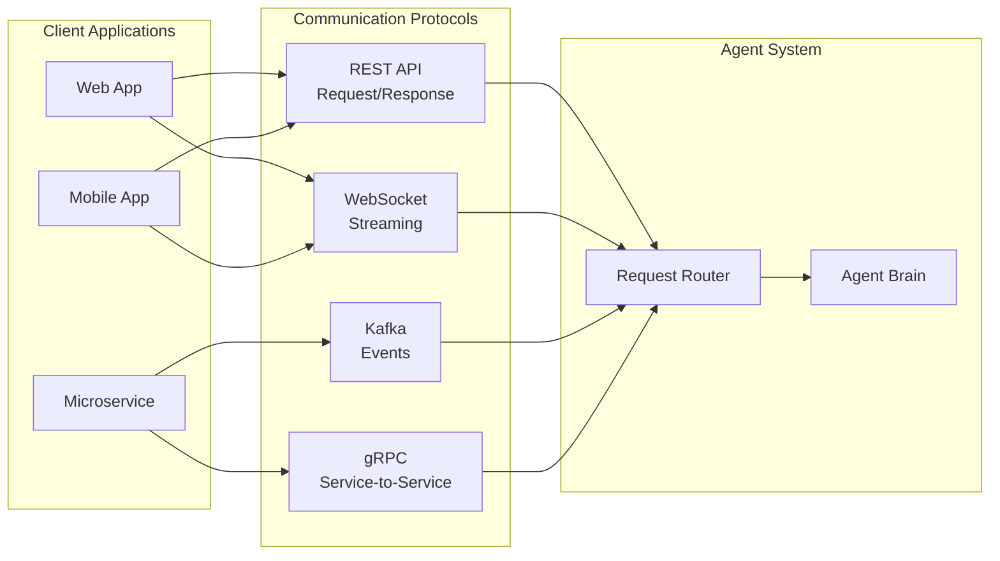

## 7. Context Building Flow

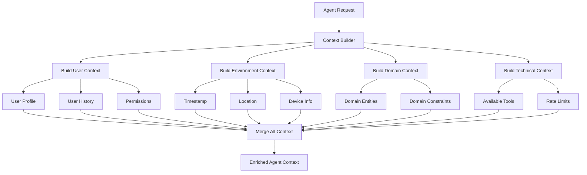

## 8. Multi-Agent Collaboration (Microagent Pattern)

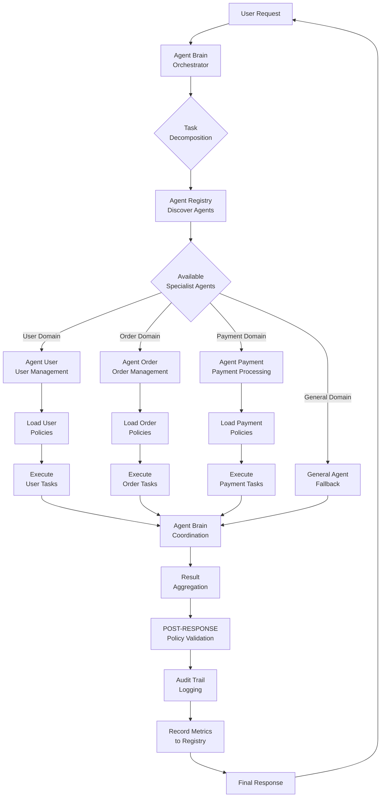

## 9. Observability & Monitoring

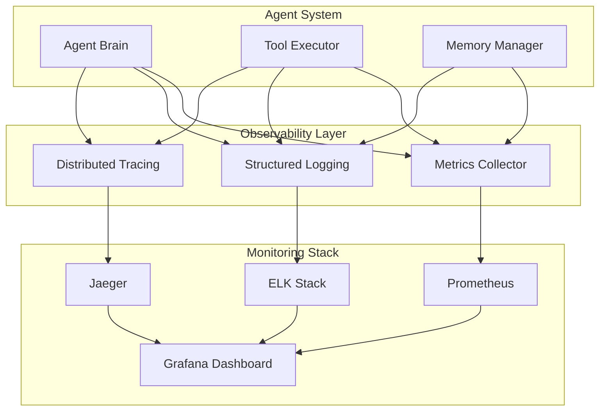

## 10. Deployment Architecture

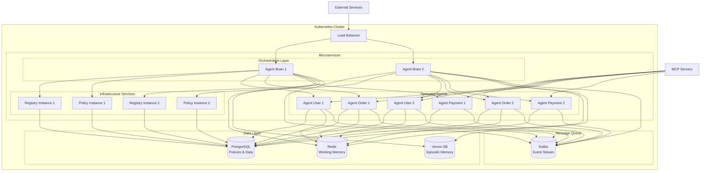

## 11. Agent Registry Architecture

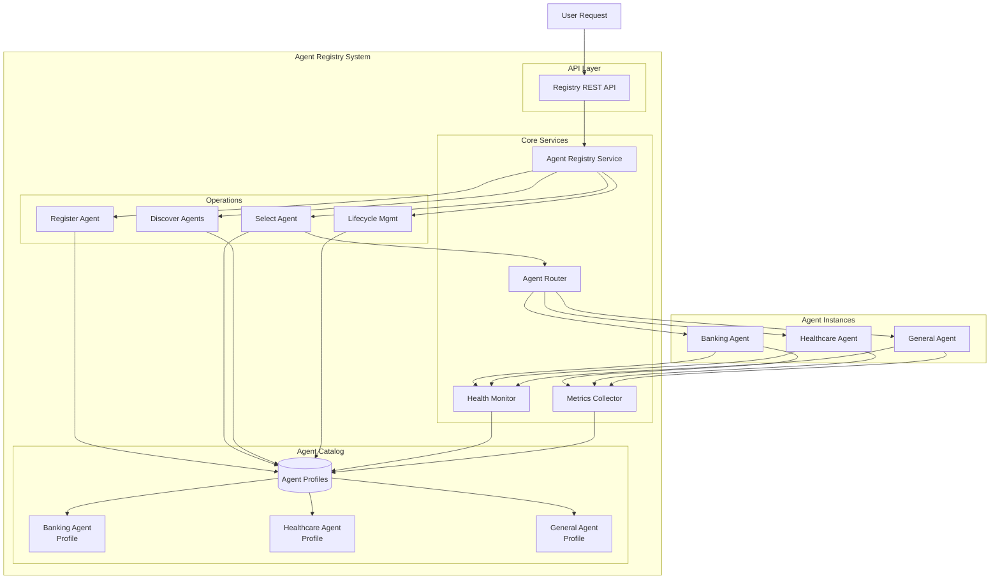

## 12. Policy Governance Architecture

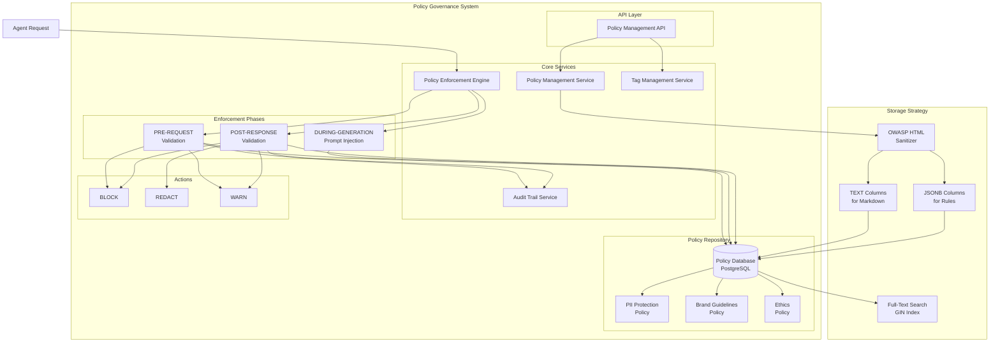

## 13. Agent Brain Orchestration Architecture

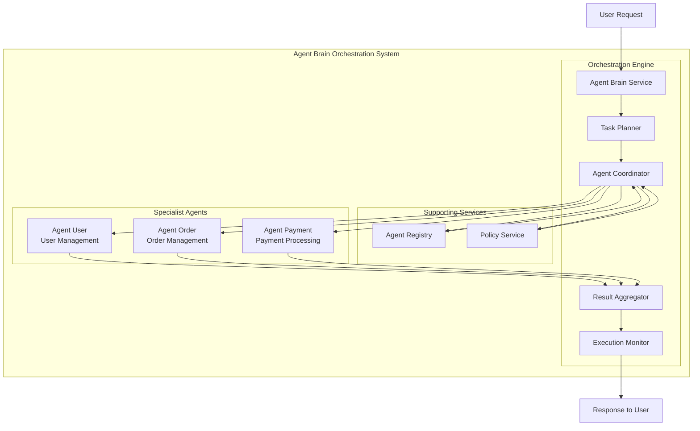

## 14. Brain + Registry + Policy + Specialist Agents Integration Flow

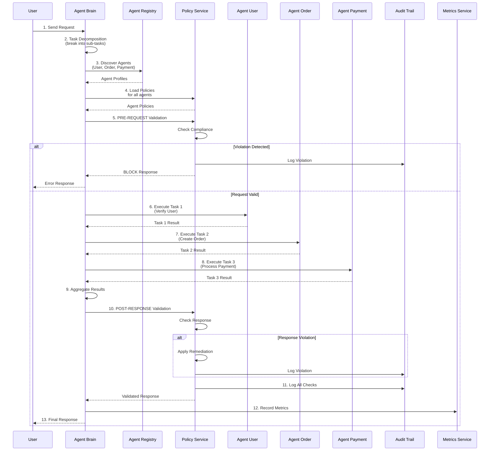

