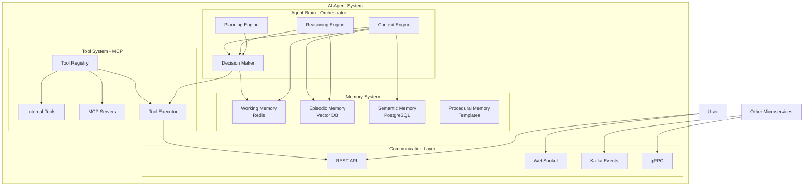
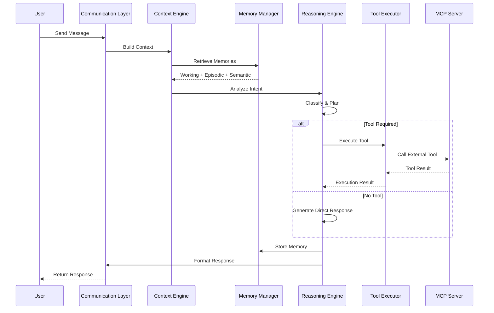
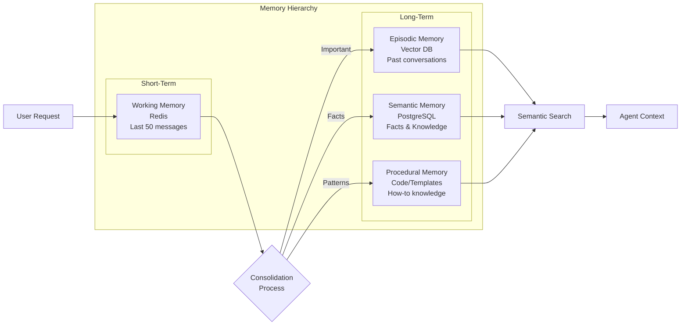
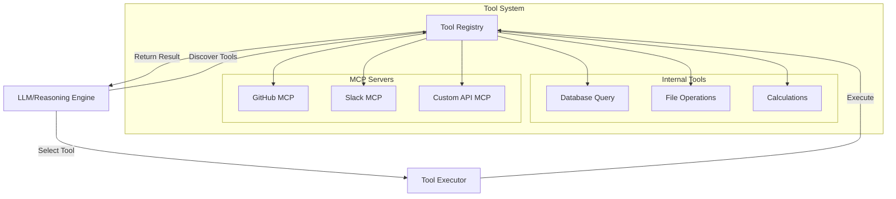
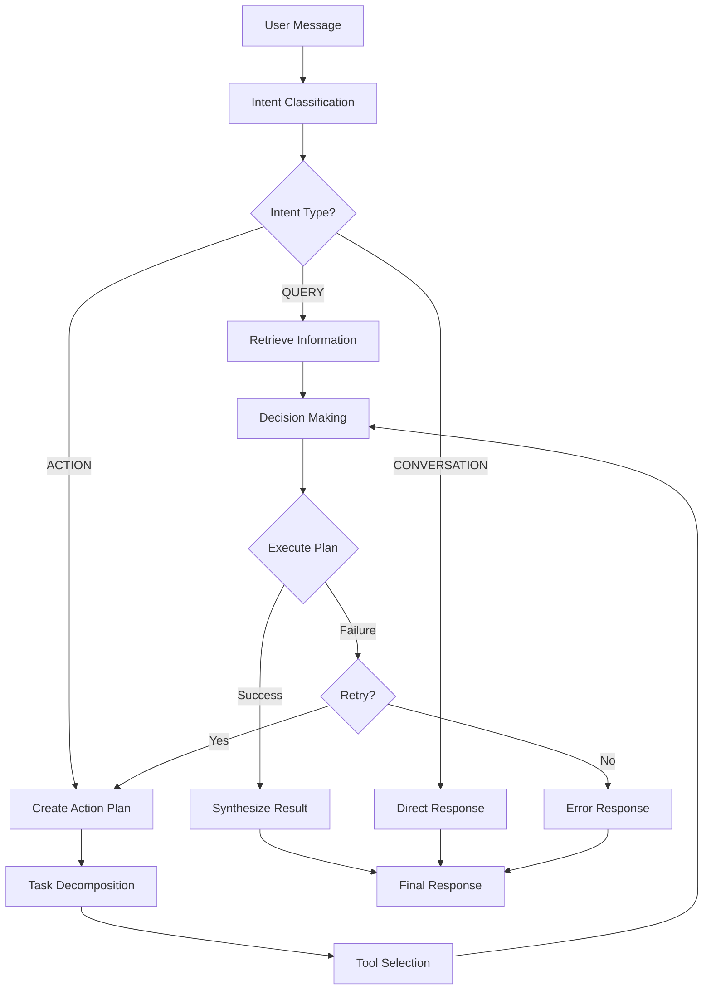
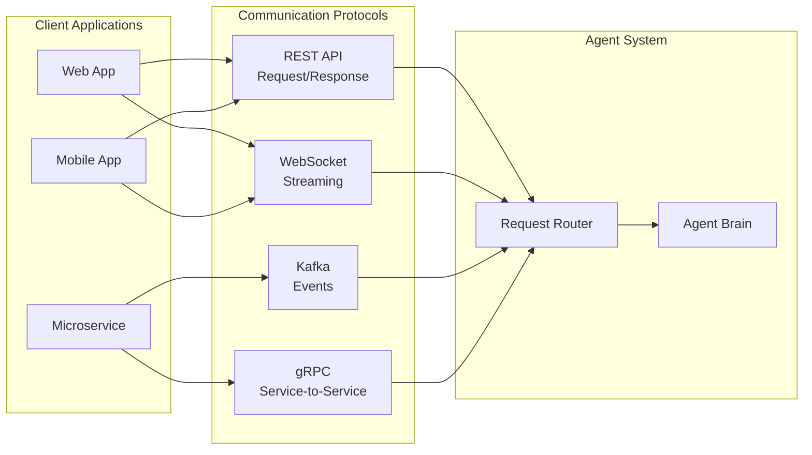
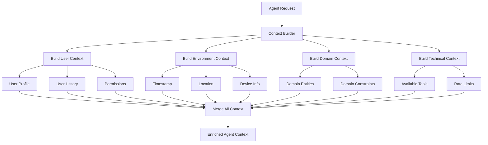
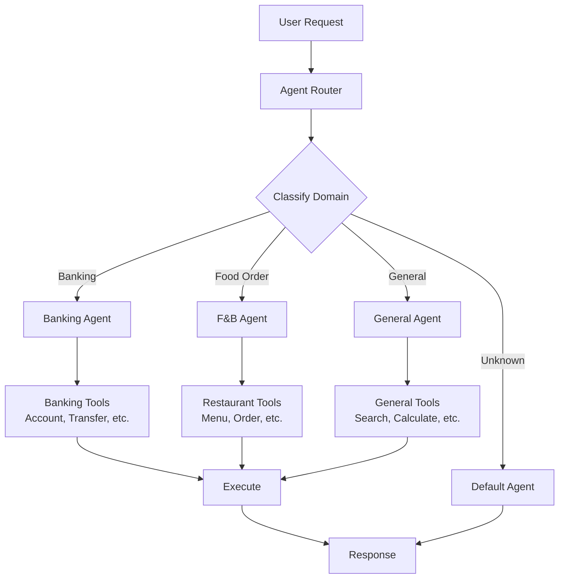
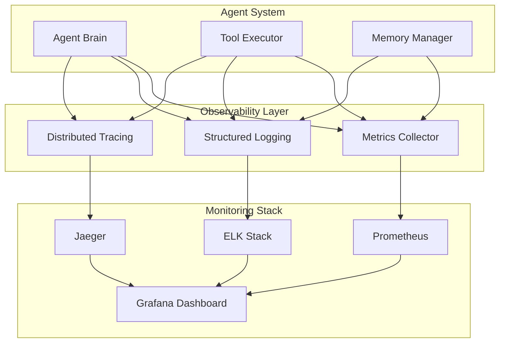
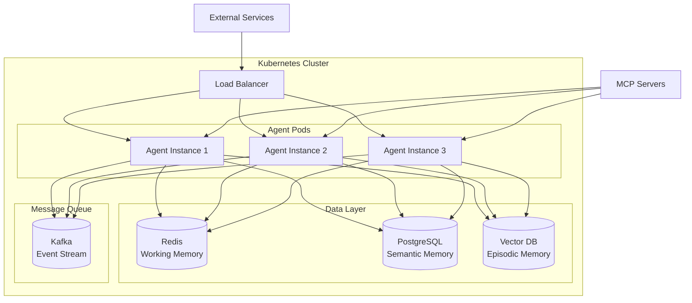

# AI Agent Architecture - Mermaid Diagrams

## 1. Component Architecture Diagram

## 2. Data Flow Sequence Diagram

## 3. Memory System Architecture

## 4. Tool/MCP Integration Architecture

## 5. Reasoning Engine Flow

## 6. Communication Protocol Options

## 7. Context Building Flow

## 8. Multi-Agent Collaboration (Microagent Pattern)

## 9. Observability & Monitoring

## 10. Deployment Architecture

